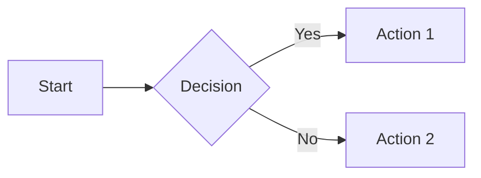

# 📚 Homelab Documentation

This repository contains the source files for Johan's homelab documentation site, built with MkDocs Material and automatically deployed to Kubernetes.

## 🚀 Live Site

📖 **[docs.staging.hallonen.se](https://docs.staging.hallonen.se)** - Staging environment  
📖 **[docs.production.hallonen.se](https://docs.production.hallonen.se)** - Production environment *(coming soon)*

## 🏗️ Built With

- **[MkDocs](https://www.mkdocs.org/)** - Static site generator
- **[Material for MkDocs](https://squidfunk.github.io/mkdocs-material/)** - Modern theme
- **[Mermaid](https://mermaid-js.github.io/)** - Diagrams as code
- **[PlantUML](https://plantuml.com/)** - UML diagrams
- **Kubernetes** - Container orchestration
- **FluxCD** - GitOps deployment
- **Traefik** - Ingress and TLS termination

## 📁 Repository Structure

```
homelab-docs/
├── docs/                          # Documentation source files
│   ├── index.md                   # Homepage
│   ├── getting-started/           # Getting started guides
│   ├── infrastructure/            # Infrastructure documentation
│   ├── kubernetes/               # Kubernetes guides
│   ├── applications/             # Application documentation
│   ├── operations/               # Operations and maintenance
│   ├── reference/                # Reference materials
│   ├── assets/                   # Images, logos, etc.
│   ├── stylesheets/              # Custom CSS
│   └── javascripts/              # Custom JavaScript
├── mkdocs.yml                    # MkDocs configuration
├── requirements.txt              # Python dependencies
└── README.md                     # This file
```

## 🚦 Getting Started

### Local Development

1. **Clone this repository**:
   ```bash
   git clone https://github.com/johanhallberg/homelab-docs.git
   cd homelab-docs
   ```

2. **Install dependencies**:
   ```bash
   pip install -r requirements.txt
   ```

3. **Start development server**:
   ```bash
   mkdocs serve
   ```

4. **Open browser**: Navigate to `http://localhost:8000`

### Live Reload

The development server supports live reload - any changes to markdown files will automatically refresh the browser.

## ✍️ Writing Documentation

### Markdown Features

This site supports extended Markdown features:

#### Code Blocks with Syntax Highlighting

```python
def hello_world():
    print("Hello, Homelab!")
```

#### Admonitions

!!! note "Information"
    This is an informational note.

!!! warning "Warning"
    This is a warning message.

!!! tip "Pro Tip"
    This is a helpful tip.

#### Mermaid Diagrams



#### Tabbed Content

=== "Tab 1"
    Content for tab 1

=== "Tab 2"
    Content for tab 2

#### Tables

| Feature | Status | Notes |
|---------|--------|-------|
| Authentication | ✅ Complete | Basic auth implemented |
| Monitoring | ✅ Complete | Prometheus + Grafana |
| Backups | 🚧 In Progress | Velero setup pending |

### Writing Guidelines

1. **Use descriptive headings** with emoji for visual appeal
2. **Include diagrams** for complex concepts using Mermaid
3. **Add code examples** with proper syntax highlighting
4. **Use admonitions** for important information
5. **Keep content updated** and remove outdated information

## 🔄 Deployment Process

### Automatic Deployment

The documentation is automatically deployed via GitOps:

1. **Push changes** to the `main` branch
2. **FluxCD detects** repository changes every 1 minute
3. **Kubernetes CronJob** syncs content every 5 minutes
4. **MkDocs pods** automatically restart with new content
5. **Site updates** are live within ~6 minutes

### Manual Deployment

For urgent updates, you can force an immediate sync:

```bash
# Trigger FluxCD reconciliation
flux reconcile source git homelab-docs

# Or manually trigger the sync job
kubectl create job --from=cronjob/docs-sync docs-sync-manual -n docs
```

## 🔧 Configuration

### MkDocs Configuration

Key configuration options in `mkdocs.yml`:

- **Site metadata**: Name, description, author
- **Theme settings**: Colors, features, navigation
- **Plugin configuration**: Search, Mermaid, Git integration
- **Markdown extensions**: Code highlighting, admonitions, etc.

### Kubernetes Deployment

The site is deployed to Kubernetes with:

- **Namespace**: `docs`
- **Replicas**: 2 (for high availability)
- **Storage**: Longhorn persistent volume
- **Ingress**: Traefik with Let's Encrypt TLS
- **Monitoring**: Prometheus metrics collection

## 📊 Analytics & Monitoring

### Performance Monitoring

The documentation site includes:

- **Prometheus metrics** for uptime and performance
- **Grafana dashboards** for visualization
- **Alerting** for downtime or errors
- **Access logs** via Traefik

### Usage Analytics

Enable Google Analytics by setting the `GOOGLE_ANALYTICS_KEY` environment variable in the deployment.

## 🤝 Contributing

### Content Contributions

1. **Fork this repository**
2. **Create a feature branch**: `git checkout -b feature/new-docs`
3. **Make your changes** in the `docs/` directory
4. **Test locally**: `mkdocs serve`
5. **Commit changes**: `git commit -m "docs: add new section"`
6. **Push and create PR**: Submit a pull request

### Reporting Issues

Found a problem? Please [open an issue](https://github.com/johanhallberg/homelab-docs/issues) with:

- **Description** of the problem
- **Steps to reproduce** (if applicable)
- **Suggested fix** (if you have one)
- **Screenshots** (if visual issue)

### Style Guide

- Use **clear, concise language**
- Include **practical examples**
- Add **visual aids** (diagrams, screenshots)
- Keep **consistent formatting**
- Test all **code examples**

## 📋 Maintenance

### Regular Tasks

- **Review and update** outdated content monthly
- **Check links** for accuracy and availability
- **Update dependencies** when security patches are available
- **Backup content** as part of regular GitOps backups

### Troubleshooting

Common issues and solutions:

| Problem | Solution |
|---------|----------|
| Site not updating | Check FluxCD status and CronJob logs |
| Broken links | Use `mkdocs serve` to test locally |
| Mermaid diagrams not rendering | Verify diagram syntax is correct |
| Build failures | Check MkDocs configuration syntax |

## 🔗 Related Repositories

- **[k8s-cluster-config](https://github.com/johanhallberg/k8s-cluster-config)** - Kubernetes GitOps configuration
- **[homelab-automation](https://github.com/johanhallberg/homelab-automation)** - Infrastructure automation scripts

## 📄 License

This documentation is licensed under the MIT License - see the [LICENSE](LICENSE) file for details.

## 🙏 Acknowledgments

- **[MkDocs team](https://www.mkdocs.org/)** for the excellent static site generator
- **[Material for MkDocs](https://squidfunk.github.io/mkdocs-material/)** for the beautiful theme
- **Homelab community** for inspiration and best practices

---

**Built with ❤️ for the homelab community**
