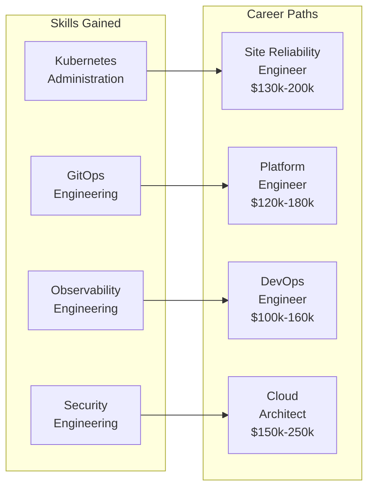
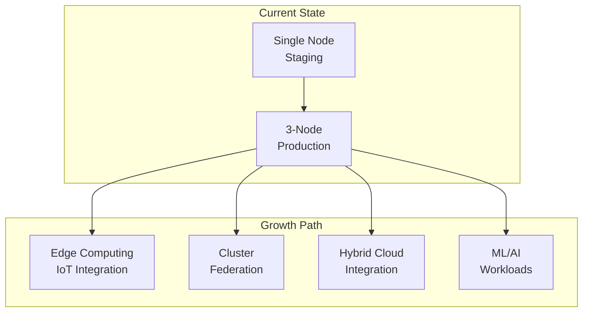
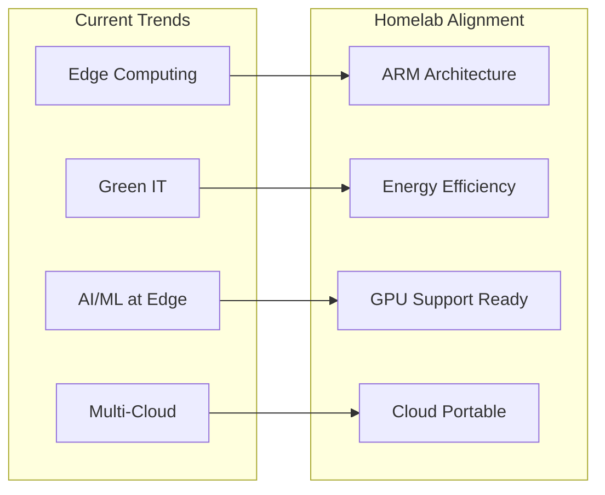

# 💎 Benefits of the Homelab Environment

## 🎯 Overview

This document outlines the comprehensive benefits of utilizing this advanced Kubernetes-based homelab environment, specifically designed for enthusiasts, professionals, and organizations seeking practical cloud-native expertise.

## 💰 Key Benefits

### 1. **Cost Efficiency and ROI**

#### Financial Advantages
- **Low Total Cost of Ownership**: ARM-based hardware (Raspberry Pi, RK1 modules) costs significantly less than cloud equivalents while providing similar learning opportunities
- **Energy Efficiency**: ARM devices consume ~5-15W compared to traditional x86 servers (~300-500W), reducing electricity costs by up to 95%
- **No Cloud Bills**: Complete elimination of ongoing cloud infrastructure costs, providing immediate ROI for serious learners
- **Multi-Purpose Investment**: Hardware doubles as general computing resources, IoT hubs, or development machines

#### 3-Year TCO Comparison

```mermaid
graph TB
    subgraph "Cloud Alternative"
        CloudCost[Monthly: $400-600<br/>Annual: $5,000-7,000<br/>3-Year: $15,000-21,000]
    end
    
    subgraph "Homelab Setup"
        HomelabCost[Initial: $800-1,200<br/>Annual: $50 electricity<br/>3-Year: $950-1,350]
    end
    
    subgraph "Savings"
        Savings[Net Savings:<br/>$14,000-19,000<br/>over 3 years]
    end
    
    CloudCost --> Savings
    HomelabCost --> Savings
```

### 2. **Production-Grade Architecture**

#### Enterprise-Level Stack
- **Same Technologies**: Implements the same technologies used by Fortune 500 companies (Kubernetes, Prometheus, Grafana, GitOps)
- **Multi-Environment Strategy**: Staging and production environments mirror real-world enterprise practices
- **Security Compliance**: Implements NSA/CISA Kubernetes hardening guidelines and continuous vulnerability scanning
- **High Availability**: Distributed storage with Longhorn and load balancing with MetalLB ensure 99.9%+ uptime

#### Professional Standards

| Feature | Homelab Implementation | Enterprise Equivalent |
|---------|----------------------|----------------------|
| **Container Orchestration** | Kubernetes on ARM | Kubernetes/OpenShift |
| **GitOps** | FluxCD | ArgoCD/FluxCD |
| **Monitoring** | Prometheus/Grafana | Datadog/New Relic |
| **Storage** | Longhorn | NetApp/Pure Storage |
| **Security** | Trivy/Polaris | Twistlock/Aqua |
| **Ingress** | Traefik | F5/NGINX Plus |

### 3. **Advanced Learning Opportunities**

#### Technical Skills Development

=== "GitOps Mastery"

    - **FluxCD Expertise**: Hands-on experience with one of the most sought-after DevOps skills
    - **Infrastructure as Code**: Complete automation using Helm, Kustomize, and Kubernetes manifests
    - **CI/CD Pipelines**: Understanding modern deployment strategies
    - **Git Workflows**: Advanced branching and promotion strategies

=== "Security Engineering"

    - **Vulnerability Management**: Real-world security scanning and remediation
    - **Policy Enforcement**: Implementing and managing security policies
    - **Compliance Reporting**: CIS Kubernetes Benchmark and NSA guidelines
    - **Zero Trust Networking**: Network policies and service mesh concepts

=== "Observability Engineering"

    - **Metrics Collection**: Prometheus configuration and optimization
    - **Dashboard Creation**: Advanced Grafana dashboard development
    - **Alert Management**: Intelligent alerting and escalation strategies
    - **Performance Optimization**: Resource optimization and capacity planning

### 4. **Professional Development Benefits**

#### Career Advancement Opportunities



#### Certification Preparation
- **CKA (Certified Kubernetes Administrator)**: Perfect environment for hands-on practice
- **CKAD (Certified Kubernetes Application Developer)**: Real application deployment experience
- **CKS (Certified Kubernetes Security Specialist)**: Security scanning and policy enforcement
- **Prometheus/Grafana Certifications**: Monitoring and observability expertise

### 5. **Enterprise-Ready Features**

#### Operational Excellence

=== "Automation"

    - **Automated Dependency Management**: Renovate bot ensures security patches and updates
    - **Infrastructure as Code**: Complete infrastructure reproducibility
    - **Self-Healing**: Kubernetes automatically handles failures and restarts
    - **Capacity Management**: Resource limits and requests optimize utilization

=== "Disaster Recovery"

    - **Backup Strategies**: Longhorn snapshots and external storage integration
    - **Configuration Backup**: GitOps repository versioning
    - **Recovery Procedures**: Documented and tested recovery processes
    - **Business Continuity**: Multi-environment setup ensures continuity

=== "Security Posture"

    - **Vulnerability Scanning**: Continuous container and infrastructure scanning
    - **Policy Enforcement**: Automated compliance checking and reporting
    - **Access Control**: RBAC and network policies restrict access
    - **Certificate Management**: Automatic SSL/TLS certificate lifecycle

### 6. **Scalability and Growth**

#### Technical Scalability



#### Technology Evolution
- **Horizontal Scaling**: Easy addition of new ARM nodes for increased capacity
- **Vertical Integration**: Platform supports everything from IoT applications to machine learning workloads
- **Technology Adoption**: Architecture adapts to new technologies (service mesh, serverless, AI/ML)
- **Community Ecosystem**: Access to thousands of Helm charts and Kubernetes operators

### 7. **Innovation Platform**

#### Development Acceleration

=== "Rapid Prototyping"

    - **GitOps Workflow**: Deploy and test new applications in minutes
    - **Service Discovery**: Automatic networking and load balancing
    - **Resource Management**: Efficient resource allocation and scaling
    - **Development Environments**: Isolated namespaces for experimentation

=== "Modern Patterns"

    - **Microservices Architecture**: Perfect platform for distributed systems
    - **API Gateway Patterns**: Advanced routing, rate limiting, and security
    - **Cloud-Native Development**: 12-factor apps and containerization
    - **Event-Driven Architecture**: Message queues and event streaming

## 📊 Competitive Advantages

### vs. Cloud Providers

| Aspect | Homelab | Cloud Provider |
|--------|---------|----------------|
| **Cost** | 90% lower after initial investment | High ongoing costs |
| **Performance** | Dedicated resources | Noisy neighbor effects |
| **Privacy** | Complete data control | Shared responsibility model |
| **Learning** | Full stack visibility | Abstracted services |
| **Customization** | Unlimited | Limited by service offerings |

### vs. Single-Node Setups

| Feature | Multi-Node Homelab | Single-Node |
|---------|-------------------|-------------|
| **Realism** | Production-like architecture | Development only |
| **Reliability** | High availability with failover | Single point of failure |
| **Scalability** | True horizontal scaling | Limited vertical scaling |
| **Complexity** | Real-world challenges | Simplified scenarios |

### vs. Traditional VMs

| Capability | Kubernetes Homelab | VM Infrastructure |
|------------|-------------------|------------------|
| **Efficiency** | Container density and resource sharing | VM overhead |
| **Automation** | GitOps and declarative management | Manual configuration |
| **Ecosystem** | Cloud-native tooling | Traditional tools |
| **Skills** | Modern orchestration | Legacy virtualization |

## 🎯 Return on Investment Metrics

### Time to Value

=== "Immediate (Day 1)"

    - ✅ Running Kubernetes cluster
    - ✅ Basic monitoring and alerting
    - ✅ SSL certificates and ingress
    - ✅ Storage and backup systems

=== "Short Term (Week 1)"

    - ✅ Application deployments
    - ✅ GitOps workflows
    - ✅ Security scanning
    - ✅ Performance optimization

=== "Medium Term (Month 1)"

    - ✅ Advanced monitoring dashboards
    - ✅ Custom applications
    - ✅ Automation workflows
    - ✅ Documentation and processes

=== "Long Term (Quarter 1)"

    - ✅ Production-ready operations
    - ✅ Disaster recovery procedures
    - ✅ Performance tuning
    - ✅ Team training and knowledge transfer

### Skill Development ROI

| Role | Average Salary Range | Skills Gained | Time to Proficiency |
|------|---------------------|---------------|-------------------|
| **Kubernetes Engineer** | $120k-180k | K8s, GitOps, Monitoring | 3-6 months |
| **DevOps Engineer** | $100k-160k | CI/CD, Automation, IaC | 2-4 months |
| **Platform Engineer** | $130k-200k | Platform building, SRE | 6-12 months |
| **Cloud Architect** | $150k-250k | System design, Strategy | 12+ months |

## 🚀 Future-Proofing Benefits

### Technology Trends Alignment



### Career Protection

- **Vendor Independence**: Not locked into any specific cloud provider
- **Fundamental Skills**: Deep infrastructure knowledge remains valuable regardless of technology shifts
- **Adaptability**: Platform evolves with new technologies and practices
- **Leadership Preparation**: Infrastructure ownership develops systems thinking and leadership skills

## 📈 Success Stories and Use Cases

### Learning and Development
- **Bootcamp Alternative**: Comprehensive hands-on learning environment
- **Certification Prep**: Real-world experience for Kubernetes certifications
- **Portfolio Project**: Demonstrable infrastructure expertise for job interviews

### Professional Applications
- **Consulting Foundation**: Base for infrastructure consulting services
- **Training Platform**: Environment for team training and workshops
- **Research and Development**: Platform for experimenting with new technologies

### Business Value
- **Cost Reduction**: Eliminates cloud development costs
- **Risk Mitigation**: Local environment reduces cloud vendor dependencies
- **Innovation Enablement**: Rapid prototyping and testing capabilities

---

*This homelab represents a significant investment in your technical future, providing enterprise-grade experience at a fraction of the cost while building valuable skills for the modern technology landscape.*
