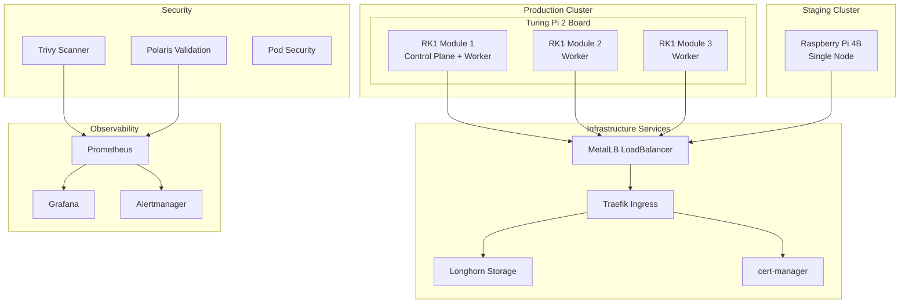
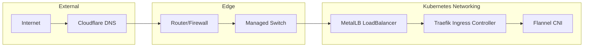
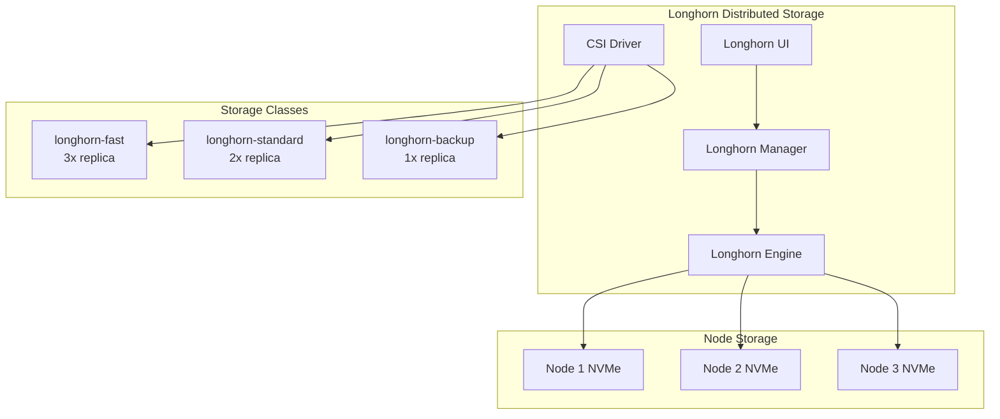
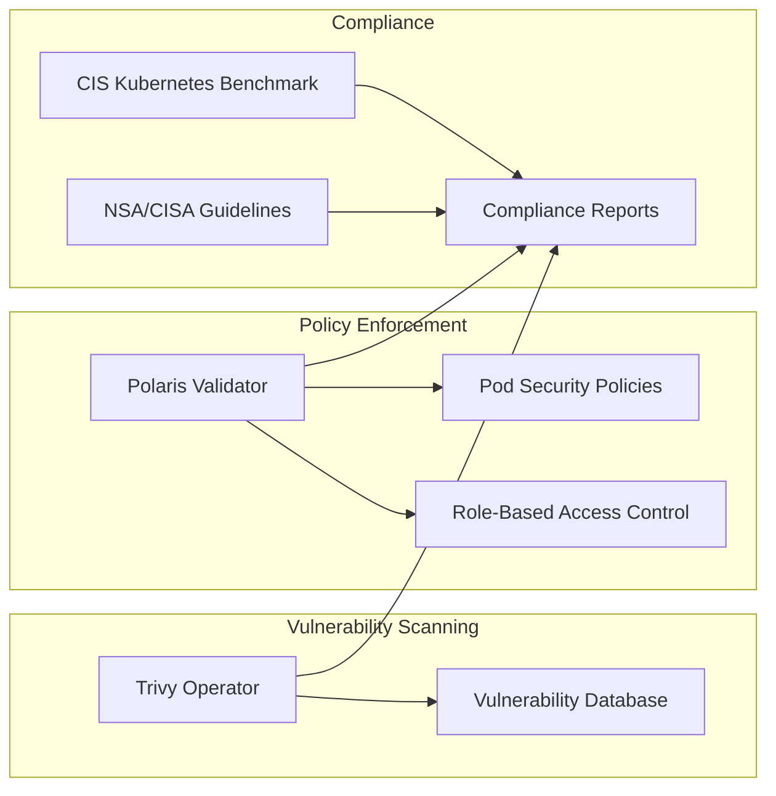
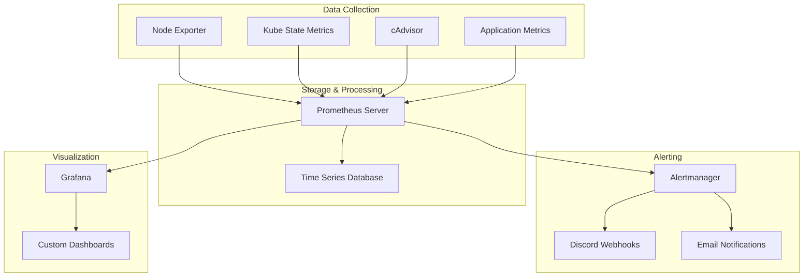
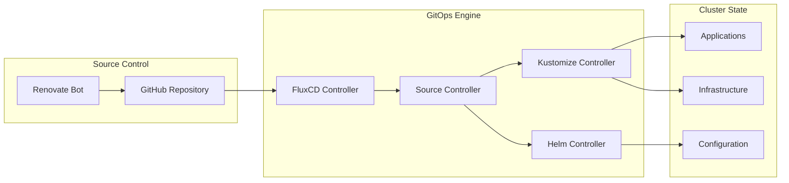
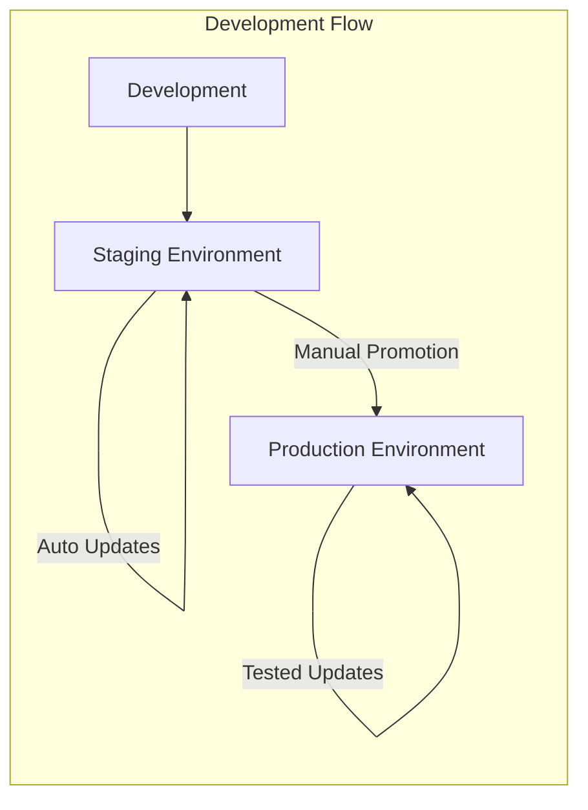

# 🏗️ Cluster Architecture

This document provides a comprehensive architectural description of the Kubernetes cluster used in the homelab environment. This setup is designed for DIY enthusiasts and developers seeking a robust, scalable, and cost-effective solution.

## 🎯 Overview

The homelab infrastructure is built around a multi-cluster Kubernetes environment designed for learning, experimentation, and running production-like workloads with enterprise-grade practices.



## 🏗️ Components

### 1. Control Plane

**Master Node Components:**
- **API Server**: Central management component for all cluster operations
- **Scheduler**: Assigns Pods to nodes based on resource requirements and constraints
- **Controller Manager**: Runs core control loops for maintaining desired state
- **etcd**: Distributed key-value store for cluster state and configuration

!!! info "High Availability"
    The production cluster uses a single control plane node for simplicity, but the architecture supports expansion to multiple control plane nodes for true HA.

### 2. Worker Nodes

**Node Components:**
- **Kubelet**: Ensures containerized applications in Pods comply with the desired state
- **Kube-proxy**: Manages networking, implementing load balancing features and network rules
- **Container Runtime**: Uses containerd for container execution (optimized for ARM64)

**Hardware Specifications:**

=== "Production (Turing Pi 2)"

    | Component | Specification |
    |-----------|---------------|
    | **Board** | Turing Pi 2 (4-slot carrier) |
    | **Modules** | 3x RK1 (ARM64, 8-core, 32GB RAM) |
    | **Storage** | 1TB NVMe per node |
    | **Network** | Gigabit Ethernet per node |
    | **OS** | Talos Linux (immutable) |

=== "Staging (Raspberry Pi)"

    | Component | Specification |
    |-----------|---------------|
    | **Device** | Raspberry Pi 4B |
    | **CPU** | 4-core ARM64 @ 1.8GHz |
    | **RAM** | 8GB LPDDR4 |
    | **Storage** | 256GB microSD + 1TB USB SSD |
    | **Network** | Gigabit Ethernet |
    | **OS** | Ubuntu 22.04 LTS |

### 3. Networking



**MetalLB Configuration:**
- **Protocol**: Layer 2 (ARP) mode for bare-metal load balancing
- **IP Pools**: 
  - Staging: `192.168.100.180-199`
  - Production: `192.168.100.160-179`
- **Speaker**: DaemonSet on all nodes for IP advertisement

**Traefik Ingress Controller:**
- **HTTP/HTTPS routing** with automatic TLS termination
- **Cloudflare integration** for DNS challenges and wildcard certificates
- **Rate limiting** and security headers
- **Dashboard** for traffic monitoring and configuration

**Network Security:**
- **NetworkPolicies**: Namespace isolation and traffic control
- **PodSecurity**: Restricted security contexts
- **TLS everywhere**: End-to-end encryption for all services

### 4. Storage



**Longhorn Features:**
- **Distributed block storage** ensuring data redundancy and backup functionalities
- **ARM optimization** with resource limits tuned for ARM nodes
- **Snapshot capabilities** for point-in-time recovery
- **Cross-zone replication** for high availability (production)
- **Web UI** for storage management and monitoring

**Storage Classes:**

| Class | Replicas | Use Case | Performance |
|-------|----------|----------|-------------|
| `longhorn-fast` | 3 | Databases, critical data | High IOPS |
| `longhorn-standard` | 2 | Application storage | Balanced |
| `longhorn-backup` | 1 | Backups, archives | Cost-effective |

### 5. Security and Compliance



**Security Components:**

=== "Trivy Operator"

    - **Continuous vulnerability scanning** for containers and infrastructure
    - **CIS Kubernetes Benchmark** compliance checking
    - **Multi-architecture support** for ARM64 and AMD64 images
    - **Prometheus integration** for metrics and alerting
    - **Daily scans** at 1 AM with automated reporting

=== "Polaris"

    - **Best practices validation** for Kubernetes workloads
    - **Real-time admission control** and audit capabilities
    - **Resource optimization** recommendations
    - **Security context validation**
    - **Web dashboard** for policy management

=== "Pod Security Standards"

    - **Restricted security contexts** by default
    - **Non-root containers** enforcement
    - **Read-only root filesystems** where possible
    - **Capability dropping** for minimal privileges
    - **seccomp profiles** for syscall filtering

### 6. Monitoring and Logging



**Monitoring Stack:**

=== "Prometheus"

    - **Metrics collection** from all cluster components
    - **30-day retention** for historical analysis
    - **HA configuration** in production with multiple replicas
    - **ARM-optimized** resource limits and requests
    - **Service discovery** for automatic target detection

=== "Grafana"

    - **Custom ARM dashboards** for hardware monitoring
    - **Multi-datasource support** (Prometheus, Loki planned)
    - **Alert visualization** and dashboard management
    - **User authentication** with basic auth
    - **Mobile-responsive** interface

=== "Alertmanager"

    - **Intelligent alert routing** with grouping and deduplication
    - **Discord integration** for real-time notifications
    - **Escalation policies** for critical alerts
    - **Maintenance windows** and alert silencing
    - **ARM-specific alerts** for temperature and resource monitoring

## 🚀 Automation

### GitOps with FluxCD



**GitOps Features:**

=== "Flux CD"

    - **Automated deployments** from Git repository changes
    - **Multi-source support** for Helm charts and Kustomize overlays
    - **Health monitoring** and reconciliation loops
    - **RBAC integration** for secure operations
    - **Image automation** for container updates

=== "Renovate Bot"

    - **Automated dependency updates** for Helm charts and container images
    - **Security-focused updates** with vulnerability scanning
    - **Semantic versioning** constraints and testing
    - **Multi-architecture** image verification
    - **PR-based workflow** for change review

## 🏢 Deployment Environments

### Environment Strategy



**Environment Configuration:**

=== "Staging"

    ```yaml
    Platform: Raspberry Pi 4B + Ubuntu
    Purpose: Development, testing, validation
    Updates: Aggressive (automatic)
    Monitoring: Full stack
    Security: Development policies
    Domain: *.staging.hallonen.se
    ```

=== "Production"

    ```yaml
    Platform: Turing Pi 2 + RK1 + Talos
    Purpose: Production workloads, stable services
    Updates: Conservative (manual promotion)
    Monitoring: Enhanced with SLAs
    Security: Production hardening
    Domain: *.local.hallonen.se
    ```

## 📊 Performance Characteristics

### Resource Optimization

**ARM64 Optimizations:**
- **Conservative CPU limits** for thermal management
- **Memory optimization** for limited RAM constraints
- **I/O optimization** for SD card longevity (staging)
- **Power-aware scheduling** for efficiency

**Multi-Architecture Support:**
- **Native ARM64 images** preferred for performance
- **Multi-platform manifests** for compatibility
- **Automated testing** on both architectures
- **Fallback strategies** for AMD64-only images

### Capacity Planning

=== "Staging Cluster"

    ```yaml
    Total Resources:
      CPU: 4 cores @ 1.8GHz
      Memory: 8GB LPDDR4
      Storage: 1TB+ (USB SSD)
    
    Typical Usage:
      CPU: 25-40% average
      Memory: 60-75% average
      Storage: 45% used
      Pods: ~45 running
    ```

=== "Production Cluster"

    ```yaml
    Total Resources:
      CPU: 24 cores (3 nodes × 8 cores)
      Memory: 96GB (3 nodes × 32GB)
      Storage: 3TB+ (3 × 1TB NVMe)
    
    Design Capacity:
      CPU: 70% target utilization
      Memory: 80% target utilization
      Storage: 75% target utilization
      Pods: ~200+ capacity
    ```

## 🔧 Hardware Specifications

### ARM Architecture Benefits

**Power Efficiency:**
- **5-15W per node** vs 300-500W for traditional servers
- **95% reduction** in electricity costs
- **Passive cooling** sufficient for most workloads
- **UPS runtime** significantly extended

**Cost Effectiveness:**
- **Low initial investment** compared to enterprise hardware
- **No cloud bills** for compute and storage
- **Multi-purpose hardware** usable beyond homelab
- **High learning ROI** for skill development

**Scalability:**
- **Horizontal scaling** by adding more ARM nodes
- **Cluster federation** for multi-site deployments
- **Edge computing** preparation for IoT workloads
- **Cloud migration** using same container images

---

*This architecture documentation is maintained as code and automatically updated with infrastructure changes. For the latest information, see the [live cluster status](../operations/cluster-status.md).*
