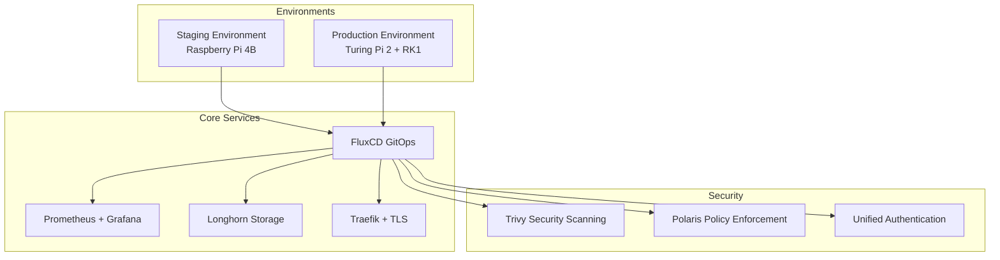

# 🚀 Getting Started with Homelab

Welcome to the ultimate homelab guide for setting up your personal cloud infrastructure using Kubernetes and other modern technologies.

## 🛠️ Setup and Configuration

### Prerequisites

Ensure the following:

- **Hardware Setup**: Servers with recommended specifications (see [Hardware Overview](../hardware/overview.md))
- **Network Configuration**: Proper VLAN configuration and router setup
- **Internet Access**: Stable internet connection to pull images and updates
- **Git Repositories**: Access to both k8s-cluster-config and homelab-docs repositories

### Initial Setup

1. **Server Configuration**: Ensure your servers meet the minimum hardware requirements.
2. **Network Configuration**: Set up VLANs and IP addressing.
3. **Base OS Installation**: Install Linux (e.g., Ubuntu 20.04 LTS) on all nodes correctly.
4. **Kubernetes Cluster**: Follow the [Cluster Setup Guide](../kubernetes/cluster-setup.md)

### 🤖 Deployment Automation

The homelab includes a comprehensive automation system that handles:

#### Automated Documentation Management
- **Service Catalog Updates**: Automatically detects new services and updates documentation
- **Real-time Synchronization**: Keeps service information current across deployments
- **Git Integration**: Commits and pushes documentation changes automatically

#### Discord Integration
- **Deployment Notifications**: Real-time alerts to #homelab-general channel
- **Status Updates**: Service deployment, update, and removal notifications
- **Rich Messaging**: Detailed information about changes with links to documentation

#### Uptime Monitoring
- **Automatic Monitor Creation**: Sets up Uptime Kuma monitors for external services
- **Health Checks**: Configures appropriate monitoring intervals and thresholds
- **Alert Integration**: Connects monitoring alerts to notification systems

#### Setup Instructions

**Quick Setup**:
```bash
# Navigate to homelab-docs repository
cd /path/to/homelab-docs

# Run the automated setup script
bash scripts/setup-automation.sh
```

**Manual Configuration**:
```bash
# Set environment variables
export DISCORD_HOMELAB_WEBHOOK="your_discord_webhook_url"
export UPTIME_KUMA_USERNAME="your_username"
export UPTIME_KUMA_PASSWORD="your_password"

# Install dependencies
pip3 install --user pyyaml requests

# Make scripts executable
chmod +x scripts/deployment-automation.py
chmod +x scripts/git-post-commit-hook.sh

# Install Git hook for automatic triggers
cp scripts/git-post-commit-hook.sh ../k8s-cluster-config/.git/hooks/post-commit
chmod +x ../k8s-cluster-config/.git/hooks/post-commit
```

**Usage Examples**:
```bash
# Add a new service manually
python3 scripts/deployment-automation.py \
  --action add \
  --name "MyApp" \
  --url "https://myapp.staging.hallonen.se" \
  --description "My awesome application"

# Scan for new services automatically
python3 scripts/deployment-automation.py --action scan

# Update an existing service
python3 scripts/deployment-automation.py \
  --action update \
  --name "MyApp" \
  --description "Updated application with new features"
```

For detailed automation documentation, see [Deployment Automation Guide](../setup/deployment-automation.md).

### GitOps Workflow

The homelab utilizes GitOps for infrastructure management:

- **FluxCD**: Automated deployment from Git repositories
- **Multi-Environment**: Separate staging and production configurations
- **Dependency Management**: Renovate for automated updates
- **Security Scanning**: Integrated vulnerability assessment

## 💡 Next Steps

Proceed to set up Kubernetes using the cluster setup guide and enhance your infrastructure by integrating additional applications as needed.

# 🚀 Getting Started with the Homelab

Welcome to the comprehensive documentation for Johan's homelab infrastructure! This guide will help you understand the architecture, get started with the environment, and make the most of the available resources.

## 🎯 What is This Homelab?

This homelab is a production-grade Kubernetes environment running on ARM-based hardware, designed for:

- **Learning**: Hands-on experience with enterprise technologies
- **Development**: Testing and developing cloud-native applications
- **Automation**: GitOps-driven infrastructure management
- **Monitoring**: Comprehensive observability and alerting

## 🏗️ Quick Architecture Overview



## 📋 Prerequisites

Before diving in, ensure you have:

### Knowledge Requirements
- **Basic Kubernetes**: Understanding of pods, services, deployments
- **Command Line**: Comfort with terminal and basic commands
- **Git**: Basic Git workflow knowledge
- **Networking**: Understanding of DNS, HTTP/HTTPS

### Tools You'll Need
- `kubectl` - Kubernetes CLI
- `flux` - FluxCD CLI (optional but recommended)
- `git` - Version control
- Web browser for accessing dashboards

## 🎯 Quick Start Paths

Choose your path based on your goals:

### 1. Explorer 🔍
**Goal**: Browse and understand the infrastructure

**Path**:
1. Read [Architecture Overview](../architecture/cluster-architecture.md)
2. Check [Staging Status](../management/staging-status.md)
3. Explore service dashboards

### 2. Learner 📚
**Goal**: Learn Kubernetes and GitOps practices

**Path**:
1. Study [Cluster Architecture](../architecture/cluster-architecture.md)
2. Follow [Setup Guides](../setup/secrets-configuration.md)
3. Practice with [Operations](../operations/troubleshooting.md)

### 3. Developer 💻
**Goal**: Deploy applications and experiment

**Path**:
1. Understand [GitOps Workflow](../kubernetes/gitops.md)
2. Review [Application Examples](../applications/services.md)
3. Learn [Monitoring](../kubernetes/monitoring.md)

### 4. Administrator 👨‍💼
**Goal**: Manage and maintain the infrastructure

**Path**:
1. Master [Environment Management](../management/staging-status.md)
2. Configure [Security](../kubernetes/security.md)
3. Handle [Operations](../operations/maintenance.md)

## 🌟 Key Features

### 🔄 GitOps Automation
- **Automated deployments** from Git changes
- **Dependency management** with Renovate
- **Multi-environment** promotion workflow

### 📊 Comprehensive Monitoring
- **Prometheus** metrics collection
- **Grafana** visualization dashboards
- **Alertmanager** with Discord integration
- **ARM-specific** hardware monitoring

### 🛡️ Security First
- **Continuous scanning** with Trivy
- **Policy enforcement** with Polaris
- **TLS everywhere** with automatic certificates
- **Unified authentication** across services

### 💾 Reliable Storage
- **Longhorn** distributed storage
- **Automatic snapshots**
- **Cross-node replication**
- **Backup strategies**

## 🔗 Quick Access Links

### Service Dashboards
- [Grafana Monitoring](https://grafana.staging.hallonen.se)
- [Prometheus Metrics](https://prometheus.staging.hallonen.se)
- [Traefik Dashboard](https://traefik.staging.hallonen.se)
- [Longhorn Storage](https://longhorn.staging.hallonen.se)

### Documentation Sections
- [Architecture](../architecture/cluster-architecture.md) - Technical deep dive
- [Setup](../setup/secrets-configuration.md) - Configuration guides
- [Operations](../operations/troubleshooting.md) - Day-to-day management
- [Reference](../reference/configuration.md) - Quick lookups

## 💡 Tips for Success

### 1. Start Small
- Begin with the staging environment
- Understand one component at a time
- Practice with simple operations first

### 2. Use the Documentation
- This documentation is comprehensive and searchable
- Follow links to dive deeper into topics
- Use the troubleshooting guides when stuck

### 3. Hands-On Learning
- Access the actual dashboards and services
- Try running commands from the examples
- Experiment in staging before production

### 4. Community Resources
- Join Kubernetes and homelab communities
- Follow the referenced documentation links
- Share your learning journey

## 🎓 Learning Path Recommendations

### Week 1: Foundation
- [ ] Read architecture overview
- [ ] Access and explore Grafana dashboards
- [ ] Understand the GitOps workflow
- [ ] Practice basic kubectl commands

### Week 2: Infrastructure
- [ ] Deep dive into networking and DNS
- [ ] Explore storage with Longhorn
- [ ] Learn about security scanning and policies
- [ ] Practice troubleshooting scenarios

### Week 3: Operations
- [ ] Master monitoring and alerting
- [ ] Practice deployment workflows
- [ ] Learn backup and recovery procedures
- [ ] Explore automation possibilities

### Week 4: Advanced Topics
- [ ] Plan your own applications
- [ ] Contribute to the documentation
- [ ] Optimize resource usage
- [ ] Design production readiness

## 🤝 Getting Help

### Documentation
- Use the search feature (top right)
- Check related pages at the bottom
- Follow the troubleshooting guides

### Community
- Kubernetes community resources
- Homelab forums and Discord servers
- GitHub discussions and issues

### Hands-On Support
- All services include monitoring and logging
- Grafana dashboards show system health
- Alerting will notify of issues

---

Ready to begin your homelab journey? Pick a path above and start exploring! 🚀
