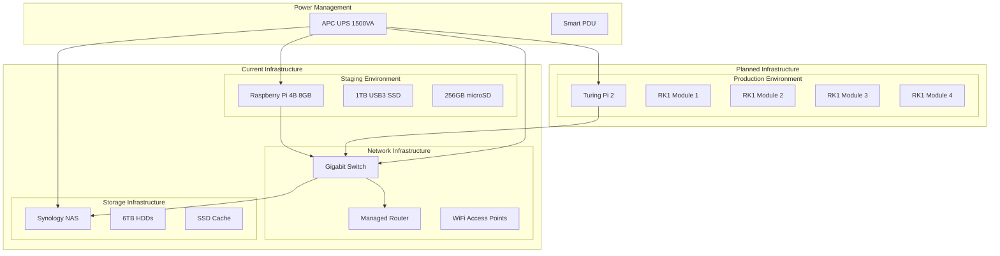
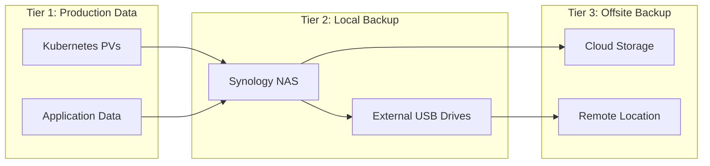

# 🖥️ Hardware Overview

This comprehensive guide details the physical infrastructure powering the homelab environment, including current hardware configurations, planned upgrades, performance characteristics, and optimization strategies.

## 🎯 Hardware Strategy

The homelab hardware approach focuses on:

- **ARM-First Architecture**: Modern ARM64 processors for efficiency and performance
- **Power Efficiency**: Low power consumption for 24/7 operation
- **Scalability**: Modular design for easy expansion
- **Cost Effectiveness**: Balance between performance and budget
- **Enterprise Features**: Learning enterprise-grade hardware management



## 🔧 Current Hardware Configuration

### Staging Environment - Raspberry Pi 4B

**Status**: ✅ **Currently Active and Stable**

#### Technical Specifications

| Component | Specification | Notes |
|-----------|---------------|-------|
| **SoC** | Broadcom BCM2711B0 | Quad-core ARM Cortex-A72 @ 1.8GHz |
| **Architecture** | ARM64 (aarch64) | 64-bit ARM architecture |
| **RAM** | 8GB LPDDR4-3200 | Maximum available for Pi 4B |
| **Primary Storage** | 256GB SanDisk Extreme Pro microSD | Class 10, U3, V30 (up to 170MB/s read) |
| **Secondary Storage** | 1TB Samsung T7 USB3 SSD | External SSD for Longhorn storage |
| **Network** | Gigabit Ethernet | Built-in Broadcom NetXtreme |
| **USB** | 2x USB 3.0, 2x USB 2.0 | USB 3.0 used for external SSD |
| **Power** | USB-C 5V/3A (15W) | Official Raspberry Pi Power Supply |
| **Cooling** | Passive + Fan | Argon One M.2 case with temperature control |

#### Performance Characteristics

```yaml
Benchmark Results:
  CPU Performance:
    - Single Core: ~800 DMIPS
    - Multi Core: ~3200 DMIPS
    - Crypto: AES hardware acceleration
  
  Memory Performance:
    - Bandwidth: ~6.4 GB/s
    - Latency: ~65ns
    - Available: ~7.3GB (after GPU allocation)
  
  Storage Performance:
    - microSD Read: ~95 MB/s
    - microSD Write: ~75 MB/s
    - USB3 SSD Read: ~400 MB/s
    - USB3 SSD Write: ~350 MB/s
  
  Network Performance:
    - Ethernet: 940 Mbps full duplex
    - Latency: <1ms local network
```

#### Current Workload Distribution

```yaml
Resource Utilization (Average):
  CPU: 25-40%
  Memory: 60-75% (4.8-6.0GB used)
  Storage: 45% (microSD), 25% (USB SSD)
  Network: 5-15% (50-150 Mbps peaks)

Active Services:
  - Kubernetes v1.33.1 (single node)
  - FluxCD GitOps
  - Traefik Ingress
  - Longhorn Storage
  - Prometheus + Grafana
  - Various applications (~45 pods)

Thermal Profile:
  - Idle: 35-40°C
  - Load: 55-65°C
  - Throttling: 80°C (rarely reached)
```

#### Limitations and Workarounds

| Limitation | Impact | Workaround |
|------------|--------|------------|
| **Single Node** | No HA for cluster components | Use external backups, quick recovery procedures |
| **ARM64 Images** | Some images not available | Use multi-arch images or build custom |
| **Memory Pressure** | Limited to 8GB total | Careful resource allocation, swap on SSD |
| **I/O Bottleneck** | microSD card performance | Move critical data to USB SSD |
| **USB Bus Sharing** | Network and storage share USB3 | Monitor bandwidth, use QoS |

### Network Infrastructure

#### Core Networking Hardware

**Router**: Managed router with VLAN support
```yaml
Model: [Your Router Model]
Features:
  - VLAN segmentation
  - Firewall with DPI
  - QoS traffic shaping
  - VPN server capabilities
  - DNS filtering support

Performance:
  - WAN: 1 Gbps
  - LAN: Gigabit switch
  - WiFi: WiFi 6 (802.11ax)
  - VPN: 100+ Mbps
```

**Managed Switch**: 24-port Gigabit switch
```yaml
Model: [Your Switch Model]
Features:
  - 24x Gigabit Ethernet ports
  - VLAN support
  - LACP link aggregation
  - SNMP monitoring
  - Web management interface

Performance:
  - Switching Capacity: 48 Gbps
  - Forwarding Rate: 35.7 Mpps
  - MAC Address Table: 8K entries
```

#### VLAN Configuration

| VLAN ID | Name | Subnet | Purpose | Devices |
|---------|------|--------|---------|---------|
| **10** | Management | 192.168.10.0/24 | Infrastructure management | Switch, Router, UPS |
| **20** | Homelab | 192.168.100.0/24 | Main cluster network | K8s nodes, NAS |
| **30** | Guest | 192.168.30.0/24 | Guest access | Isolated guest network |
| **40** | IoT | 192.168.40.0/24 | IoT devices | Smart home devices |

### Storage Infrastructure

#### Primary NAS - Synology DS920+

```yaml
Model: Synology DiskStation DS920+
CPU: Intel Celeron J4125 (4-core, 2.0-2.7GHz)
RAM: 8GB DDR4 (upgraded from 4GB)
Drive Bays: 4x 3.5" SATA
M.2 Slots: 2x NVMe for caching

Current Configuration:
  Data Drives:
    - 2x 6TB WD Red Plus (RAID 1)
    - 2x 4TB WD Red (RAID 1)
  Cache:
    - 2x 512GB Samsung 980 NVMe (read/write cache)
  
Total Capacity:
  - Usable: ~9TB
  - Protection: RAID 1 (mirror)
  - Performance: SSD cache acceleration

Services:
  - File sharing (SMB/NFS)
  - Container Station (Docker)
  - Surveillance Station
  - Cloud backup
  - Time Machine backup
```

#### Backup Strategy



### Power and Environmental

#### UPS Configuration

**Model**: APC Back-UPS Pro 1500VA (BR1500MS)

```yaml
Specifications:
  Capacity: 1500VA / 865W
  Runtime: 
    - 50% load: ~10 minutes
    - 25% load: ~25 minutes
  Battery: 12V, 18Ah sealed lead acid
  
Connected Devices:
  - Raspberry Pi 4B: ~15W
  - Synology NAS: ~65W
  - Managed Switch: ~25W
  - Router: ~20W
  
Total Load: ~125W (14% of capacity)
Estimated Runtime: ~45 minutes

Features:
  - Automatic voltage regulation (AVR)
  - Surge protection
  - USB/network monitoring
  - Automatic graceful shutdown
```

#### Environmental Monitoring

| Metric | Current | Target Range | Alert Threshold |
|--------|---------|--------------|-----------------|
| **Ambient Temperature** | 22°C | 18-25°C | >30°C |
| **Humidity** | 45% | 40-60% | <30% or >70% |
| **CPU Temperature** | 42°C | <65°C | >75°C |
| **Power Consumption** | 125W | <200W | >300W |
| **UPS Battery Health** | 98% | >80% | <50% |

## 🚀 Planned Production Infrastructure

### Turing Pi 2 Cluster Board

**Status**: 🚧 **Planned for Q1 2025**

#### Cluster Board Specifications

```yaml
Model: Turing Pi 2 (v2.4)
Form Factor: Mini-ITX compatible
Compute Module Slots: 4x
Per-Slot Resources:
  - PCIe 3.0 x4 lane
  - Gigabit Ethernet
  - USB 3.0
  - GPIO access
  - UART console

Shared Resources:
  - BMC with IPMI 2.0
  - eMMC boot storage
  - MicroSD failsafe boot
  - ATX power connector
  - HDMI output (shared)
  - 4x USB 3.0 ports

Management Features:
  - Web-based BMC interface
  - IPMI over LAN
  - Serial console access
  - Remote power control
  - Temperature monitoring
  - Fan speed control
```

#### Compute Modules - RK1

**Per Module Specifications**:

```yaml
Model: Turing RK1 (ARM64)
SoC: Rockchip RK3588
Architecture: ARM64 (aarch64)

CPU Configuration:
  - 4x ARM Cortex-A76 @ 2.4GHz (performance cores)
  - 4x ARM Cortex-A55 @ 1.8GHz (efficiency cores)
  - Total: 8 cores per module, 32 cores per cluster

Memory: 32GB LPDDR5-6400 per module
Storage: 64GB eMMC 5.1 per module
Expansion: M.2 2280 NVMe slot per module

GPU: ARM Mali-G610 MP4
AI Accelerator: 6 TOPS NPU
Video: 8K60 decode, 8K30 encode

Network: Gigabit Ethernet per module
Power: 25-30W per module under load
```

#### Cluster Specifications

| Resource | Per Module | Total Cluster | Notes |
|----------|------------|---------------|-------|
| **CPU Cores** | 8 cores | 32 cores | 16 performance + 16 efficiency |
| **Memory** | 32GB | 128GB | LPDDR5-6400 |
| **Storage (eMMC)** | 64GB | 256GB | Fast boot storage |
| **Storage (NVMe)** | 1TB | 4TB | High-performance storage |
| **Network** | 1 Gbps | 4 Gbps | Independent NICs |
| **Power** | 30W | 120W | Plus board overhead |

#### Performance Projections

```yaml
Expected Performance:
  CPU Benchmark:
    - Single Core: ~1800 DMIPS (2.25x Pi 4B)
    - Multi Core: ~14400 DMIPS (4.5x Pi 4B)
    - AI Workloads: 24 TOPS total
  
  Memory Performance:
    - Bandwidth: ~51 GB/s per module
    - Total: ~204 GB/s cluster
    - Latency: ~45ns
  
  Storage Performance:
    - eMMC: ~300 MB/s sequential
    - NVMe: ~3500 MB/s sequential
    - Random: ~500K IOPS
  
  Network Performance:
    - Per module: 940 Mbps
    - Aggregate: 3.76 Gbps
    - Inter-node: High-speed PCIe fabric
```

#### Planned Node Configuration

| Node | Role | Workload Focus | Resources |
|------|------|----------------|-----------|
| **rk1-node-1** | Control Plane + Worker | Core services, databases | 32GB RAM, 1TB NVMe |
| **rk1-node-2** | Worker | Applications, web services | 32GB RAM, 1TB NVMe |
| **rk1-node-3** | Worker | Monitoring, logging | 32GB RAM, 1TB NVMe |
| **rk1-node-4** | Worker | Future expansion | 32GB RAM, 1TB NVMe |

## 🔄 Migration Strategy

### Phase 1: Infrastructure Preparation

**Timeline**: Q1 2025

1. **Hardware Acquisition**
   - [ ] Purchase Turing Pi 2 cluster board
   - [ ] Acquire 4x RK1 compute modules
   - [ ] Obtain 4x 1TB NVMe SSDs
   - [ ] Upgrade UPS capacity if needed

2. **Network Preparation**
   - [ ] Verify switch port availability
   - [ ] Configure VLANs for production
   - [ ] Update DNS for production endpoints
   - [ ] Plan IP address allocation

3. **Software Preparation**
   - [ ] Prepare Talos Linux images
   - [ ] Configure GitOps for production
   - [ ] Update monitoring for multi-node
   - [ ] Plan storage migration

### Phase 2: Cluster Deployment

**Timeline**: Q1-Q2 2025

1. **Initial Setup**
   - [ ] Install and configure Turing Pi 2
   - [ ] Flash compute modules
   - [ ] Configure BMC and management
   - [ ] Install Talos Linux

2. **Kubernetes Bootstrap**
   - [ ] Initialize control plane
   - [ ] Join worker nodes
   - [ ] Configure storage (Longhorn)
   - [ ] Deploy networking (CNI)

3. **Service Migration**
   - [ ] Deploy core services
   - [ ] Migrate monitoring stack
   - [ ] Move application workloads
   - [ ] Validate functionality

### Phase 3: Optimization and Expansion

**Timeline**: Q2-Q3 2025

1. **Performance Tuning**
   - [ ] Optimize resource allocation
   - [ ] Tune storage performance
   - [ ] Configure monitoring alerts
   - [ ] Load testing and validation

2. **Advanced Features**
   - [ ] Implement service mesh
   - [ ] Advanced monitoring (Thanos)
   - [ ] ML/AI workload experiments
   - [ ] Multi-cluster federation

## 📊 Performance Comparison

### Current vs. Planned Infrastructure

| Metric | Raspberry Pi 4B | Turing Pi 2 Cluster | Improvement |
|--------|-----------------|---------------------|-------------|
| **CPU Cores** | 4 cores | 32 cores | 8x |
| **CPU Performance** | 3.2 GDMIPS | 14.4 GDMIPS | 4.5x |
| **Memory** | 8GB | 128GB | 16x |
| **Storage** | 1TB USB SSD | 4TB NVMe + eMMC | 4x+ capacity, >10x speed |
| **Network** | 1 Gbps | 4 Gbps | 4x |
| **Power** | 15W | 120W | 8x (but 8x performance) |
| **Availability** | Single point of failure | HA cluster | 99.9%+ |

### Workload Capacity Projection

```yaml
Current Capacity (Pi 4B):
  Active Pods: ~45
  CPU Utilization: 25-40%
  Memory Utilization: 60-75%
  Storage: Limited by I/O

Projected Capacity (Turing Pi 2):
  Active Pods: 200-300+
  CPU Utilization: 15-25% (same workload)
  Memory Utilization: 20-30% (same workload)
  Storage: High-performance, multi-replica

New Capabilities:
  - AI/ML workloads (24 TOPS NPU)
  - Video processing (8K encode/decode)
  - High-availability databases
  - Service mesh deployments
  - Multi-tenant environments
```

## 🛡️ Hardware Security

### Physical Security

- **Secure Location**: Equipment in locked network cabinet
- **Access Control**: Physical access logging
- **Tamper Detection**: BMC alerts for case opening
- **Cable Management**: Organized and secured cabling

### Firmware Security

- **Secure Boot**: Verified boot chain
- **TPM**: Hardware security module (where available)
- **UEFI Updates**: Regular firmware updates
- **BMC Security**: Secure BMC passwords and network isolation

### Supply Chain

- **Vendor Verification**: Purchase from authorized distributors
- **Hardware Validation**: Verify authenticity upon receipt
- **Update Sources**: Use official firmware sources only
- **Documentation**: Maintain hardware inventory and certificates

## 🔧 Maintenance and Monitoring

### Preventive Maintenance Schedule

| Component | Frequency | Tasks |
|-----------|-----------|-------|
| **UPS Battery** | Monthly | Capacity test, visual inspection |
| **Cooling Systems** | Monthly | Clean fans, check temperatures |
| **Storage Health** | Weekly | SMART monitoring, usage analysis |
| **Network Equipment** | Quarterly | Firmware updates, configuration backup |
| **BMC/Management** | Monthly | Security updates, log review |

### Hardware Monitoring

```yaml
Monitoring Stack:
  BMC Monitoring:
    - Temperature sensors
    - Fan speeds
    - Power consumption
    - Hardware health
  
  OS-Level Monitoring:
    - Node Exporter metrics
    - System resource usage
    - Hardware error logs
    - Storage health (SMART)
  
  Network Monitoring:
    - SNMP from managed switches
    - Interface utilization
    - Error rates
    - Link status
  
  Environmental:
    - UPS status and battery health
    - Rack temperature
    - Humidity levels
    - Power usage effectiveness
```

### Alert Configuration

```yaml
Critical Alerts:
  - Hardware failure (immediate)
  - Temperature >80°C (immediate)
  - UPS on battery >5 minutes (immediate)
  - Storage failure (immediate)

Warning Alerts:
  - High resource utilization >85% (15 minutes)
  - Temperature >70°C (5 minutes)
  - Network errors >1% (10 minutes)
  - UPS battery <80% health (daily)

Info Alerts:
  - Firmware updates available (weekly)
  - Hardware maintenance due (weekly)
  - Performance degradation trends (daily)
```

## 💰 Cost Analysis

### Current Investment

| Component | Cost | Lifespan | Annual Cost |
|-----------|------|----------|-------------|
| Raspberry Pi 4B 8GB | $75 | 5 years | $15 |
| Samsung T7 1TB SSD | $100 | 7 years | $14 |
| Case and accessories | $50 | 5 years | $10 |
| Power consumption | $20/year | Ongoing | $20 |
| **Total Annual** | | | **$59** |

### Planned Investment

| Component | Cost | Lifespan | Annual Cost |
|-----------|------|----------|-------------|
| Turing Pi 2 board | $200 | 7 years | $29 |
| 4x RK1 modules | $800 | 7 years | $114 |
| 4x 1TB NVMe SSDs | $400 | 7 years | $57 |
| Case and cooling | $100 | 7 years | $14 |
| Power consumption | $80/year | Ongoing | $80 |
| **Total Annual** | | | **$294** |

### ROI Analysis

```yaml
Performance per Dollar:
  Current: 3.2 GDMIPS / $59 = 54 DMIPS/$
  Planned: 14.4 GDMIPS / $294 = 49 DMIPS/$
  
Value Considerations:
  - Learning enterprise ARM ecosystem
  - High availability capabilities
  - Professional development value
  - Future-proofing for ARM64 adoption
  - Reduced cloud service costs
```

## 🌱 Sustainability

### Power Efficiency

```yaml
Power Usage Effectiveness (PUE):
  Current Setup:
    - IT Load: 125W
    - Infrastructure: 25W (UPS efficiency loss)
    - PUE: 1.2 (excellent for homelab)
  
  Planned Setup:
    - IT Load: 200W
    - Infrastructure: 30W
    - PUE: 1.15 (improved efficiency)

Carbon Footprint:
  Annual Power: ~2000 kWh
  CO2 Equivalent: ~800 kg/year (regional grid mix)
  Offset: Home solar panels (planned)
```

### Lifecycle Management

- **Hardware Reuse**: Repurpose Pi 4B for edge computing
- **Responsible Disposal**: Proper e-waste recycling
- **Energy Efficiency**: ARM64 processors over x86
- **Longevity**: Choose hardware with long support cycles

## 📚 Additional Resources

### Hardware Documentation

- [Raspberry Pi Foundation](https://www.raspberrypi.org/documentation/)
- [Turing Pi Documentation](https://docs.turingpi.com/)
- [RK3588 Technical Reference](https://rockchip.fr/RK3588%20datasheet)

### Community Resources

- [ARM Server Ready](https://developer.arm.com/architectures/platform-design/server-ready)
- [CNCF ARM64 Working Group](https://github.com/cncf/wg-arm64)
- [Homelab Hardware Communities](https://www.reddit.com/r/homelab)

### Vendor Support

- **Turing Pi**: Community forum and documentation
- **Rockchip**: Official SDK and documentation
- **Component Vendors**: Warranty and RMA processes

---

This hardware infrastructure provides a solid foundation for learning modern ARM64 technologies while maintaining cost-effectiveness and power efficiency. The planned migration to Turing Pi 2 will provide enterprise-grade capabilities in a homelab environment.
