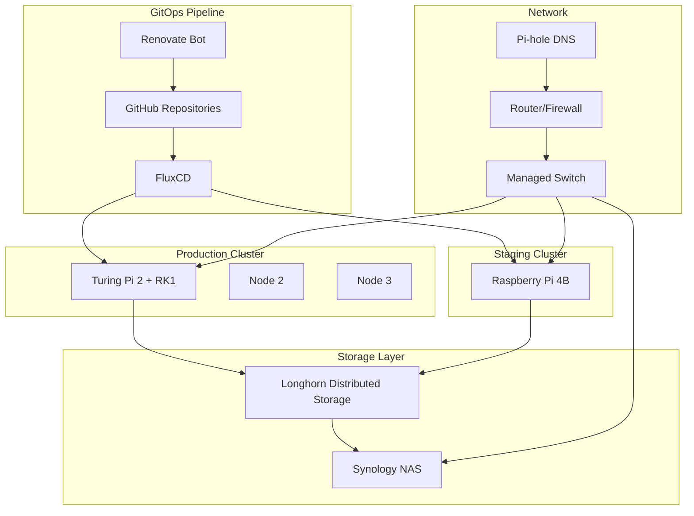

# 🏠 Welcome to Homelab Documentation

This is the comprehensive documentation hub for Johan's modern homelab infrastructure, featuring GitOps-managed Kubernetes clusters, automated monitoring, and enterprise-grade practices on ARM-based hardware.

## 🚀 Quick Navigation

<div class="grid cards" markdown>

- :fontawesome-solid-rocket: **[Getting Started](getting-started/overview.md)**

    ---

    New to the homelab? Start here for setup guides and prerequisites.

- :fontawesome-solid-server: **[Infrastructure](infrastructure/homelab-layout.md)**

    ---

    Hardware architecture, network design, and storage solutions.

- :fontawesome-solid-ship: **[Kubernetes](kubernetes/cluster-setup.md)**

    ---

    Container orchestration, GitOps workflows, and cluster management.

- :fontawesome-solid-chart-line: **[Monitoring](applications/monitoring.md)**

    ---

    Observability stack with Prometheus, Grafana, and alerting.

</div>

## 🏗️ Architecture Overview



## 🎯 Key Features

### 💿 **Infrastructure as Code**
- **GitOps workflows** with FluxCD for automated deployments
- **Renovate integration** for dependency management
- **Multi-environment** staging and production clusters

### 🛡️ **Security & Monitoring**
- **Comprehensive monitoring** with Prometheus and Grafana
- **Vulnerability scanning** with Trivy Operator
- **Policy enforcement** with Polaris
- **Automated alerting** via Discord webhooks

### 🌐 **Networking & Ingress**
- **Traefik** ingress controller with automatic TLS
- **Let's Encrypt** certificates with DNS challenges
- **MetalLB** load balancing for bare-metal clusters

### 📊 **Storage Solutions**
- **Longhorn** distributed storage across cluster nodes
- **Synology NAS** for backup and bulk storage
- **Automated backup strategies** for data protection

## 🔗 Service Access

!!! info "Service URLs"
    All services are accessible via secure HTTPS with automatic TLS certificates:

    **Staging Environment:**
    
    - 📊 [Grafana Dashboard](https://grafana.staging.hallonen.se)
    - 📈 [Prometheus Metrics](https://prometheus.staging.hallonen.se)
    - 🚨 [Alertmanager](https://alertmanager.staging.hallonen.se)
    - 🔒 [Polaris Security](https://polaris.staging.hallonen.se)
    - 💾 [Longhorn Storage](https://longhorn.staging.hallonen.se)
    - 🔧 [Traefik Dashboard](https://traefik.staging.hallonen.se)
    - 📚 [Documentation](https://docs.staging.hallonen.se) _(this site)_

## 📱 Quick Status

=== "Cluster Health"

    ```yaml
    Staging Cluster: ✅ Online
    Production Cluster: 🚧 Planned
    
    Nodes: 1/1 Ready
    Pods: 45/45 Running
    Storage: 85% Available
    ```

=== "Recent Updates"

    ```yaml
    Last Deployment: 2025-06-26T21:54:19Z
    FluxCD Status: ✅ Synced
    Cert Renewals: ✅ Automated
    Security Scans: ✅ Passed
    ```

=== "Monitoring"

    ```yaml
    Uptime: 99.9%
    Response Time: <100ms
    Alerts: 0 Critical
    Temperature: 62°C (Normal)
    ```

## 🛠️ Recent Changes

<div class="annotate" markdown>

- **2025-06-26**: Added comprehensive documentation site with Material theme (1)
- **2025-06-25**: Unified authentication across all services
- **2025-06-24**: Monitoring stack deployment completed
- **2025-06-23**: Traefik ingress configuration finalized

</div>

1. You're reading it right now! 🎉

## 🤝 Contributing

This documentation is automatically built from the [homelab-docs](https://github.com/johanhallberg/homelab-docs) repository. To contribute:

1. Fork the repository
2. Make your changes in the `docs/` directory
3. Submit a pull request
4. Changes are automatically deployed upon merge

## 📋 Support

!!! question "Need Help?"
    - Check the [troubleshooting guide](operations/troubleshooting.md)
    - Review [common issues](operations/troubleshooting.md#common-issues)
    - Open an issue in the [GitHub repository](https://github.com/johanhallberg/homelab-docs/issues)

---

*Last updated: {{ git_revision_date_localized }}*
