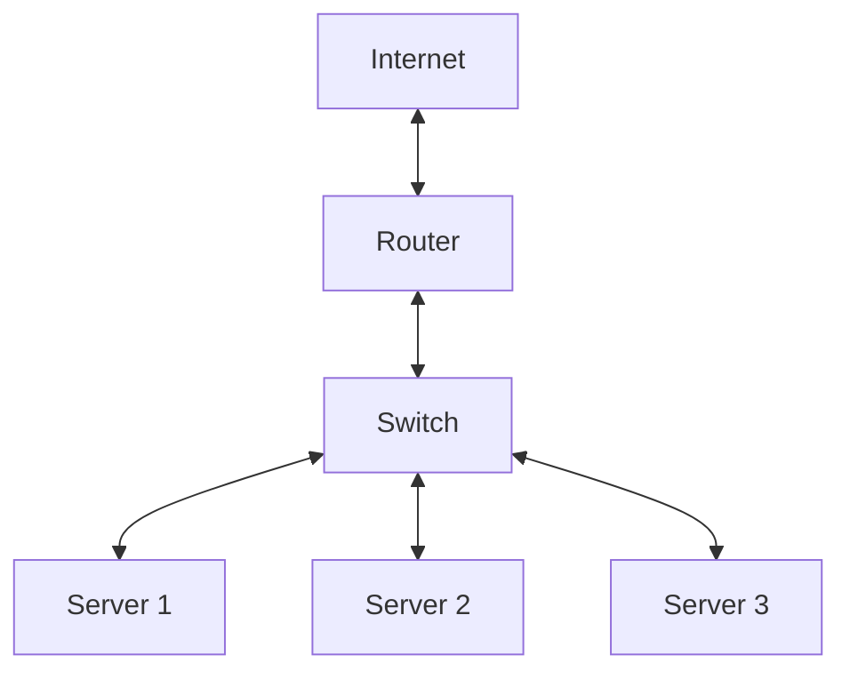
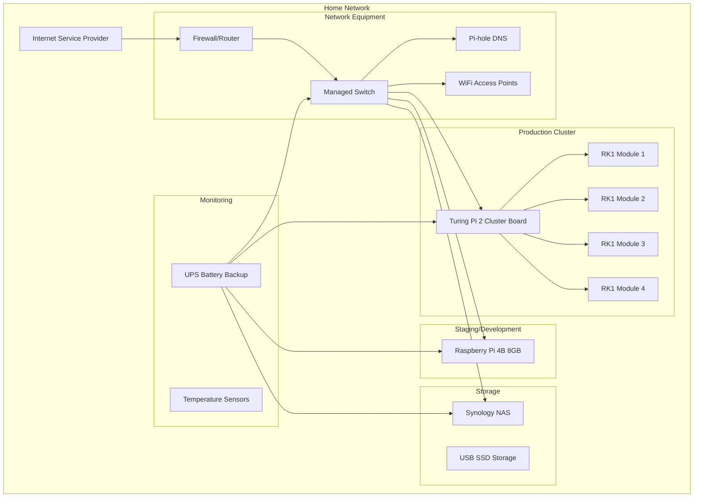
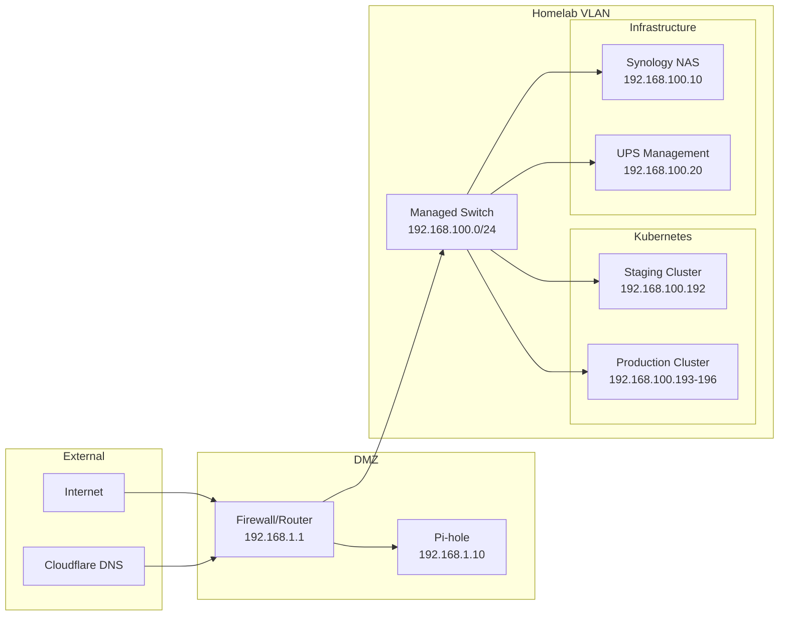
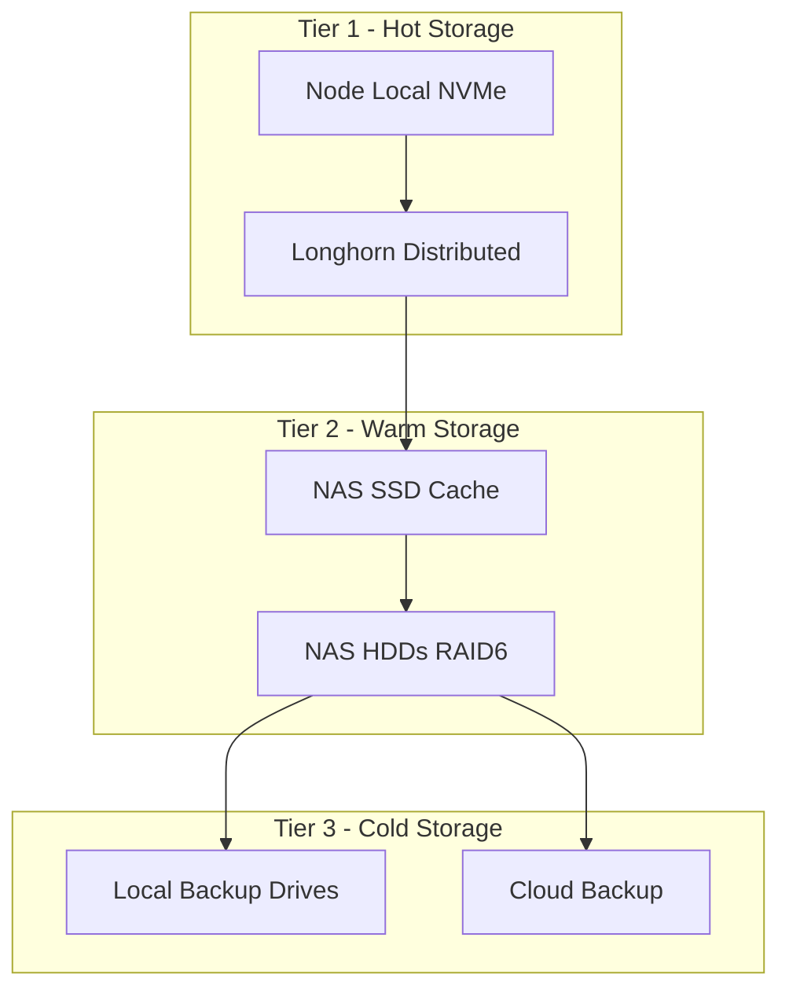
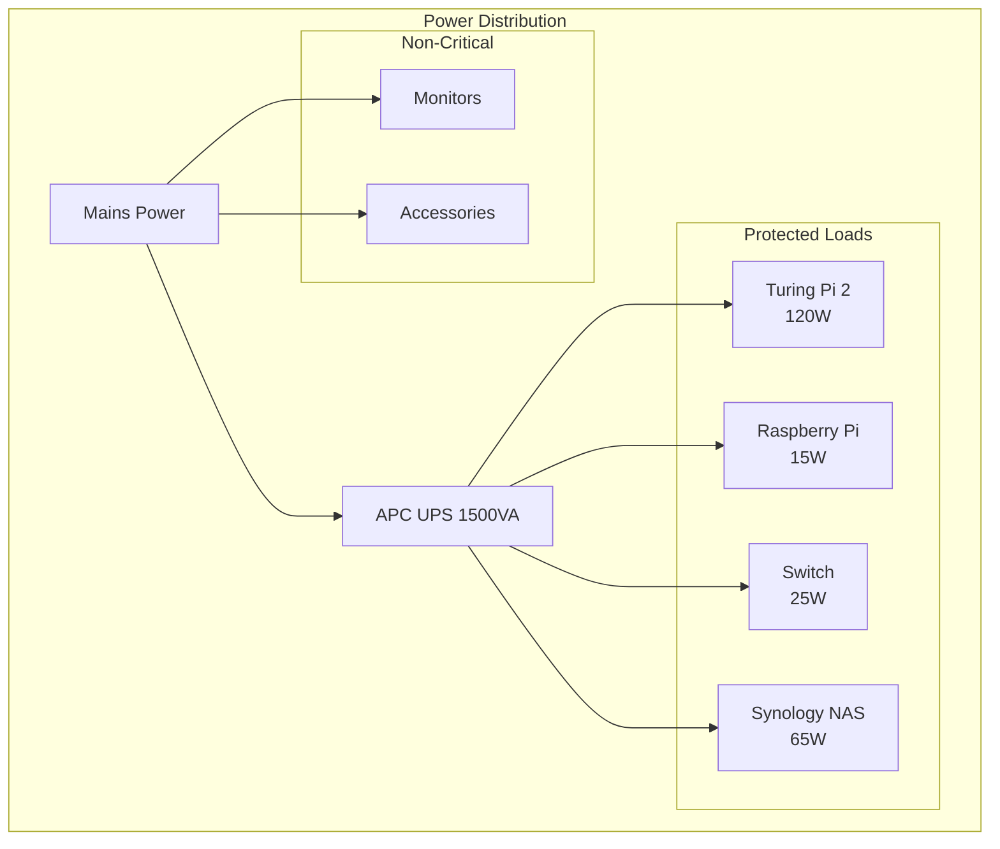
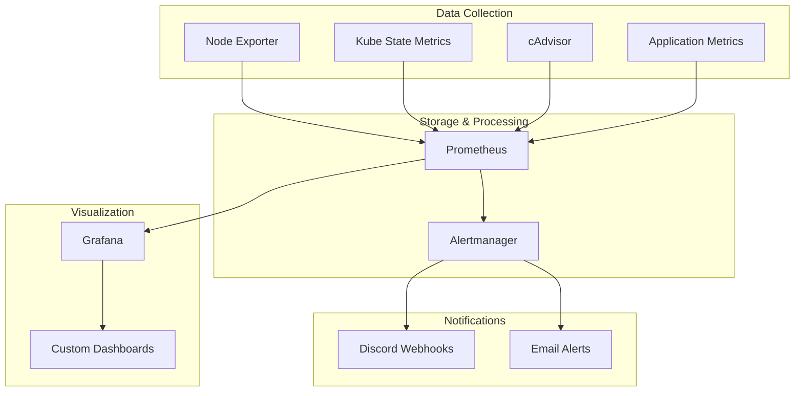

# 🏠 Homelab Infrastructure Layout

This document details the physical and logical layout of the homelab setup, including hardware specifications, network topology, and service distribution for efficient cluster management.

## 📋 Hardware Overview

### Server Specifications

- **Server 1**: Intel Xeon 16-Core, 128GB RAM, 2TB NVMe SSD
- **Server 2**: AMD Ryzen 8-Core, 64GB RAM, 1TB SSD
- **Server 3**: Intel i7 6-Core, 32GB RAM, 500GB NVMe SSD

## 🌐 Network Topology

### Topology Map



### Network Segmentation

- **VLAN 10 (Management)**: 192.168.10.0/24
- **VLAN 20 (Storage)**: 192.168.20.0/24
- **VLAN 30 (Guest)**: 192.168.30.0/24

## 📡 Service Allocation

### Cluster Distribution

- **K8s Master Nodes**: Server 1, Server 2
- **K8s Worker Nodes**: Server 1, Server 3
- **Storage Nodes**: Server 1, Server 2

## 🚀 Deployment Process

Deployment strategies leverage GitOps through a combination of FluxCD and automated CI/CD pipelines for seamless operation deployment across the homelab environment.

---

This setup ensures high availability and flexibility to adapt to the evolving needs of both development and production workloads.

# 🏗️ Homelab Architecture

This page documents the complete architecture and layout of Johan's homelab infrastructure, designed for learning, experimentation, and running production-like workloads.

## 🎯 Overview

The homelab is built around a multi-cluster Kubernetes environment with a focus on:

- **GitOps automation** with FluxCD
- **Infrastructure as Code** practices
- **ARM-based hardware** optimization
- **Enterprise-grade monitoring** and security
- **Cost-effective** yet robust solutions

## 🏠 Physical Layout



## 🖥️ Hardware Specifications

### Production Cluster - Turing Pi 2

!!! info "Turing Pi 2 Cluster Board"
    **Status**: 🚧 Planned - Not yet deployed
    
    **Specifications**:
    
    - **Cluster Board**: Turing Pi 2 (4-node carrier board)
    - **Compute Modules**: 4x RK1 (8-core ARM64, 32GB RAM each)
    - **Total Resources**: 32 cores, 128GB RAM
    - **Storage**: NVMe SSDs per node + shared NAS
    - **Network**: Gigabit Ethernet per node
    - **Power**: 120W total consumption

=== "Node Details"

    | Node | CPU | RAM | Storage | Role |
    |------|-----|-----|---------|------|
    | rk1-node-1 | 8-core ARM64 | 32GB | 1TB NVMe | Control Plane + Worker |
    | rk1-node-2 | 8-core ARM64 | 32GB | 1TB NVMe | Worker |
    | rk1-node-3 | 8-core ARM64 | 32GB | 1TB NVMe | Worker |
    | rk1-node-4 | 8-core ARM64 | 32GB | 1TB NVMe | Worker (Future expansion) |

=== "Advantages"

    - **High Density**: 4 nodes in single board form factor
    - **ARM64 Native**: Excellent for modern cloud-native workloads
    - **Power Efficient**: <30W per node under load
    - **Scalable**: Easy to add/remove compute modules
    - **Enterprise Features**: BMC, remote management, IPMI

### Staging Cluster - Raspberry Pi

!!! success "Raspberry Pi 4B"
    **Status**: ✅ Currently Active
    
    **Specifications**:
    
    - **Model**: Raspberry Pi 4B
    - **CPU**: 4-core ARM64 Cortex-A72 @ 1.8GHz
    - **RAM**: 8GB LPDDR4
    - **Storage**: 256GB SanDisk Extreme Pro microSD + 1TB USB3 SSD
    - **Network**: Gigabit Ethernet
    - **Power**: 15W typical

=== "Current Workloads"

    ```yaml
    Kubernetes Version: v1.33.1
    Container Runtime: containerd
    CNI: Flannel
    Storage CSI: Longhorn
    
    Active Pods: ~45
    CPU Usage: 25-40%
    Memory Usage: 60-75%
    Storage Usage: 45%
    ```

=== "Limitations"

    - **Single Node**: No high availability
    - **Resource Constraints**: Limited for resource-intensive workloads
    - **Storage I/O**: SD card bottleneck (mitigated with USB SSD)
    - **Network**: Single NIC (no redundancy)

## 🌐 Network Architecture

### Network Topology



### IP Address Allocation

| Range | Purpose | Notes |
|-------|---------|-------|
| `192.168.1.0/24` | Management Network | Router, DNS, etc. |
| `192.168.100.0/24` | Homelab VLAN | Main cluster network |
| `192.168.100.192/29` | Kubernetes Nodes | Static node IPs |
| `192.168.100.200-250` | MetalLB Pool | LoadBalancer services |
| `10.42.0.0/16` | Pod Network (Flannel) | Internal pod communication |
| `10.43.0.0/16` | Service Network | Kubernetes services |

### DNS Strategy

=== "External DNS"

    ```yaml
    Provider: Cloudflare
    Domain: hallonen.se
    
    Records:
      - staging.hallonen.se → 192.168.100.192
      - *.staging.hallonen.se → 192.168.100.192
      - production.hallonen.se → 192.168.100.193
      - *.production.hallonen.se → 192.168.100.193
    ```

=== "Internal DNS"

    ```yaml
    Provider: Pi-hole
    Upstream: Cloudflare (1.1.1.1)
    
    Local Records:
      - cluster.local → Kubernetes internal
      - nas.home → 192.168.100.10
      - homelab.local → Management interfaces
    ```

## 💾 Storage Architecture

### Storage Tiers



### Storage Classes

| Class | Technology | Use Case | Performance | Availability |
|-------|-----------|----------|-------------|--------------|
| `longhorn-fast` | NVMe + 3x replication | Databases, hot data | High | HA |
| `longhorn-standard` | SSD + 2x replication | Application storage | Medium | HA |
| `longhorn-backup` | HDD + 1x replication | Backups, archives | Low | Standard |
| `nas-storage` | NFS to Synology | Media, bulk storage | Medium | Single point |

### Backup Strategy

!!! warning "Backup Policy"
    Following the 3-2-1 backup rule:
    
    - **3** copies of important data
    - **2** different storage types
    - **1** offsite backup

=== "Kubernetes Backups"

    ```yaml
    Method: Longhorn Snapshots + Velero
    Frequency: 
      - Snapshots: Every 6 hours
      - Full backups: Daily
      - Retention: 30 days local, 90 days offsite
    
    Target: 
      - Local: Synology NAS
      - Offsite: Cloud storage (planned)
    ```

=== "Application Data"

    ```yaml
    Databases: 
      - Automated dumps before snapshots
      - Point-in-time recovery capability
    
    Configuration:
      - GitOps repository versioning
      - Secrets backup to encrypted store
    
    Media/Documents:
      - Real-time sync to NAS
      - Weekly cloud backup
    ```

## 🔌 Power & Environmental

### Power Management



### Environmental Monitoring

| Metric | Normal Range | Alert Threshold | Monitoring |
|--------|--------------|-----------------|------------|
| **Temperature** | 20-25°C ambient | >30°C ambient | BMC + External sensors |
| **Humidity** | 40-60% RH | <30% or >70% | External sensors |
| **Power Draw** | 200-300W total | >400W | UPS monitoring |
| **Uptime** | 99.5%+ | <99% monthly | Prometheus alerts |

### Cooling Strategy

!!! tip "Passive + Active Cooling"
    
    **Passive Cooling**:
    - Open rack design for airflow
    - Heat sinks on all SoCs
    - Thermal pads for heat distribution
    
    **Active Cooling**:
    - Temperature-controlled fans
    - Automatic throttling at 80°C
    - Alert notifications at 75°C

## 🔧 Management & Monitoring

### Remote Management

=== "Hardware Level"

    ```yaml
    Turing Pi 2:
      - BMC with web interface
      - IPMI over LAN
      - Serial console access
      - Remote power control
    
    Raspberry Pi:
      - SSH access
      - GPIO monitoring
      - Temperature sensors
      - Watchdog timer
    ```

=== "Kubernetes Level"

    ```yaml
    Tools:
      - kubectl (CLI access)
      - k9s (Terminal UI)
      - Lens (Desktop GUI)
      - Web dashboards
    
    GitOps:
      - FluxCD for deployments
      - Renovate for updates
      - GitHub Actions for CI/CD
    ```

### Monitoring Stack



## 🚀 Future Roadmap

### Phase 1 - Production Deployment *(Q1 2025)*
- [ ] Deploy Turing Pi 2 with RK1 modules
- [ ] Install Talos Linux on production cluster
- [ ] Migrate critical workloads from staging
- [ ] Implement HA for core services

### Phase 2 - Enhanced Capabilities *(Q2 2025)*
- [ ] Velero backup integration
- [ ] Service mesh with Istio
- [ ] Advanced monitoring with Thanos
- [ ] ML/AI workload experiments

### Phase 3 - Optimization *(Q3-Q4 2025)*
- [ ] Performance tuning and optimization
- [ ] Cost analysis and efficiency improvements
- [ ] Documentation and knowledge sharing
- [ ] Community contributions

---

*This architecture documentation is maintained as code and automatically updated with infrastructure changes.*
