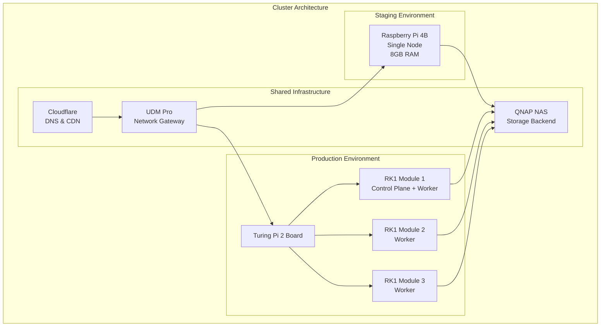
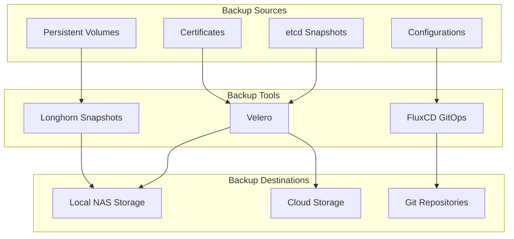
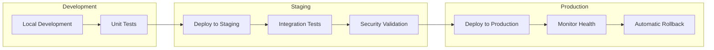

# 🚀 Kubernetes Cluster Setup

This comprehensive guide covers the complete setup and configuration of our multi-environment Kubernetes clusters, designed for enterprise-grade homelab infrastructure with ARM optimization and GitOps automation.

## 🎯 Overview

Our Kubernetes deployment follows a multi-cluster strategy optimized for learning, development, and production-like workloads on ARM-based hardware. The architecture emphasizes reliability, security, and cost-effectiveness while maintaining enterprise practices.



## 🏗️ Hardware Architecture

### Staging Cluster (Active)

**Primary Node: Raspberry Pi 4B**

| Component | Specification | Justification |
|-----------|---------------|---------------|
| **SoC** | BCM2711 (ARM64 Cortex-A72) | Excellent ARM ecosystem support |
| **CPU** | 4-core @ 1.8GHz | Sufficient for development workloads |
| **RAM** | 8GB LPDDR4 | Optimized for K8s overhead + applications |
| **Storage** | 1TB USB 3.0 SSD | Fast I/O for etcd and container images |
| **Boot** | 256GB microSD (U3) | Reliable boot partition |
| **Network** | Gigabit Ethernet | Adequate bandwidth for homelab |
| **Power** | Official USB-C PSU (25W) | Stable power delivery |

!!! tip "Why Single-Node Staging?"
    The staging environment uses a single-node configuration for several strategic reasons:
    
    - **Cost Efficiency**: Minimizes hardware investment while validating architecture
    - **Learning Focus**: Simplifies troubleshooting and understanding
    - **Resource Optimization**: All resources available for application testing
    - **Rapid Iteration**: Faster deployment cycles for development

### Production Cluster (Planned)

**Platform: Turing Pi 2 + RK1 Modules**

| Component | Specification | Scaling Strategy |
|-----------|---------------|------------------|
| **Board** | Turing Pi 2 (4-slot carrier) | Enterprise-grade cluster board |
| **Modules** | 3x RK1 (ARM64, 8-core, 32GB) | High-performance ARM compute |
| **Total CPU** | 24 cores @ 2.4GHz | Excellent performance/watt ratio |
| **Total RAM** | 96GB DDR5 | Future-proof memory allocation |
| **Storage** | 1TB NVMe per node | Low-latency distributed storage |
| **Networking** | Gigabit per node + 10Gb uplink | High-bandwidth cluster fabric |
| **Management** | BMC + IPMI | Remote management capabilities |

!!! info "Production Design Philosophy"
    The production cluster design prioritizes:
    
    - **High Availability**: Multi-node design with redundancy
    - **Performance**: High-end ARM processors with ample memory
    - **Scalability**: Room for growth with 4th module slot
    - **Management**: Enterprise-grade remote management
    - **Efficiency**: Optimized performance per watt

## 🖥️ Operating System Strategy

### Staging: Ubuntu 22.04 LTS

**Rationale**: Ubuntu provides the most comprehensive ARM64 ecosystem support for development and testing.

```yaml
OS Configuration:
  Base: Ubuntu 22.04.3 LTS (ARM64)
  Kernel: 5.15+ with cgroup v2 support
  Container Runtime: containerd 1.7+
  Init System: systemd
  Package Manager: apt
  
Security Hardening:
  - Unattended security updates
  - UFW firewall configured
  - SSH key-only authentication
  - Fail2ban for intrusion prevention
  - Regular security scanning
```

### Production: Talos Linux

**Rationale**: Talos provides immutable infrastructure ideal for production Kubernetes deployment.

```yaml
OS Configuration:
  Base: Talos Linux (Immutable)
  Kernel: Custom hardened kernel
  Container Runtime: containerd (embedded)
  Init System: Custom init
  API: Talos API (no SSH)
  
Advantages:
  - Immutable OS (no configuration drift)
  - API-driven management
  - Minimal attack surface
  - Automatic updates
  - Built-in security
```

## 🔧 Kubernetes Installation

### Base Cluster Installation

The clusters use **kubeadm** for standardized, upstream Kubernetes installation with custom configurations optimized for ARM hardware.

```bash
# Staging cluster initialization (Ubuntu)
sudo kubeadm init \
  --pod-network-cidr=10.42.0.0/16 \
  --service-cidr=10.43.0.0/16 \
  --control-plane-endpoint=kubestaging.local.hallonen.se \
  --upload-certs \
  --v=5

# Configure kubectl for admin access
mkdir -p $HOME/.kube
sudo cp -i /etc/kubernetes/admin.conf $HOME/.kube/config
sudo chown $(id -u):$(id -g) $HOME/.kube/config
```

### ARM64 Optimizations

**Memory Management**: Optimized for constrained memory environments

```yaml
# kubelet configuration
apiVersion: kubelet.config.k8s.io/v1beta1
kind: KubeletConfiguration
maxPods: 110
podPidsLimit: 2048
containerLogMaxSize: 10Mi
containerLogMaxFiles: 3
evictionHard:
  memory.available: "200Mi"
  nodefs.available: "10%"
evictionSoft:
  memory.available: "500Mi"
evictionSoftGracePeriod:
  memory.available: "1m30s"
```

**Container Runtime Tuning**: Optimized containerd configuration

```toml
# /etc/containerd/config.toml
version = 2
[plugins."io.containerd.grpc.v1.cri"]
  sandbox_image = "registry.k8s.io/pause:3.9"
  max_container_log_line_size = 16384
  
[plugins."io.containerd.grpc.v1.cri".containerd]
  snapshotter = "overlayfs"
  
[plugins."io.containerd.grpc.v1.cri".containerd.runtimes.runc.options]
  SystemdCgroup = true
```

## 🌐 Network Architecture

### Container Network Interface (CNI)

**Flannel**: Chosen for simplicity and ARM64 compatibility

```yaml
apiVersion: v1
kind: ConfigMap
metadata:
  name: kube-flannel-cfg
  namespace: kube-flannel
data:
  cni-conf.json: |
    {
      "name": "cbr0",
      "cniVersion": "0.3.1",
      "plugins": [
        {
          "type": "flannel",
          "delegate": {
            "hairpinMode": true,
            "isDefaultGateway": true
          }
        },
        {
          "type": "portmap",
          "capabilities": {
            "portMappings": true
          }
        }
      ]
    }
  net-conf.json: |
    {
      "Network": "10.42.0.0/16",
      "Backend": {
        "Type": "vxlan"
      }
    }
```

!!! info "Why Flannel?"
    Flannel was selected over alternatives like Calico or Cilium for specific reasons:
    
    - **Simplicity**: Easy to understand and troubleshoot
    - **ARM64 Support**: Excellent compatibility with ARM architecture
    - **Resource Efficiency**: Lower memory footprint on constrained hardware
    - **VXLAN Backend**: Reliable encapsulation without complex routing

### Load Balancing with MetalLB

**Configuration**: Layer 2 mode for bare-metal load balancing

```yaml
apiVersion: metallb.io/v1beta1
kind: IPAddressPool
metadata:
  name: staging-pool
  namespace: metallb-system
spec:
  addresses:
  - 192.168.100.180-192.168.100.199
---
apiVersion: metallb.io/v1beta1
kind: L2Advertisement
metadata:
  name: staging-l2
  namespace: metallb-system
spec:
  ipAddressPools:
  - staging-pool
```

**Network Allocation Strategy**:

| Environment | IP Range | Purpose | Notes |
|------------|----------|---------|-------|
| Staging | 192.168.100.180-199 | LoadBalancer services | 20 IPs available |
| Production | 192.168.100.160-179 | LoadBalancer services | 20 IPs available |
| Management | 192.168.100.200-220 | BMC and IPMI | Hardware management |
| Reserved | 192.168.100.221-254 | Future expansion | Growth capacity |

## 🔐 Security Configuration

### Pod Security Standards

Implementation of restricted security policies by default:

```yaml
apiVersion: v1
kind: Namespace
metadata:
  name: applications
  labels:
    pod-security.kubernetes.io/enforce: restricted
    pod-security.kubernetes.io/audit: restricted
    pod-security.kubernetes.io/warn: restricted
```

### Network Policies

Default-deny network policies with explicit allow rules:

```yaml
apiVersion: networking.k8s.io/v1
kind: NetworkPolicy
metadata:
  name: default-deny-all
spec:
  podSelector: {}
  policyTypes:
  - Ingress
  - Egress
---
apiVersion: networking.k8s.io/v1
kind: NetworkPolicy
metadata:
  name: allow-same-namespace
spec:
  podSelector: {}
  ingress:
  - from:
    - namespaceSelector:
        matchLabels:
          name: applications
  egress:
  - to:
    - namespaceSelector:
        matchLabels:
          name: applications
```

### RBAC Configuration

Principle of least privilege with custom roles:

```yaml
apiVersion: rbac.authorization.k8s.io/v1
kind: ClusterRole
metadata:
  name: monitoring-reader
rules:
- apiGroups: [""]
  resources: ["nodes", "pods", "services", "endpoints"]
  verbs: ["get", "list", "watch"]
- apiGroups: ["apps"]
  resources: ["deployments", "replicasets"]
  verbs: ["get", "list", "watch"]
```

## 💾 Storage Architecture

### Local Storage Optimization

**Staging Configuration**: Single-node optimized storage

```yaml
# Local storage class for high-performance workloads
apiVersion: storage.k8s.io/v1
kind: StorageClass
metadata:
  name: local-nvme
provisioner: kubernetes.io/no-provisioner
volumeBindingMode: WaitForFirstConsumer
reclaimPolicy: Retain
```

**Production Configuration**: Distributed storage with Longhorn

```yaml
# Longhorn storage classes for different performance tiers
apiVersion: storage.k8s.io/v1
kind: StorageClass
metadata:
  name: longhorn-fast
provisioner: driver.longhorn.io
allowVolumeExpansion: true
reclaimPolicy: Retain
parameters:
  numberOfReplicas: "3"
  dataLocality: "best-effort"
  fromBackup: ""
```

## 🔄 Cluster Lifecycle Management

### Automated Updates

**Strategy**: Staged rollouts with automated testing

```yaml
# Update strategy configuration
apiVersion: config.k8s.io/v1alpha1
kind: UpdateConfig
spec:
  strategy: RollingUpdate
  maxUnavailable: 1
  testSuite:
    enabled: true
    healthChecks:
    - name: api-server
      endpoint: /healthz
    - name: dns-resolution
      command: nslookup kubernetes.default.svc.cluster.local
```

### Backup Strategy

**Comprehensive backup approach** covering all critical components:



## 📊 Monitoring and Observability

### Cluster Health Monitoring

**Key Metrics**: Focused on ARM-specific concerns and resource constraints

```yaml
# Custom ServiceMonitor for ARM64 metrics
apiVersion: monitoring.coreos.com/v1
kind: ServiceMonitor
metadata:
  name: arm64-hardware
spec:
  selector:
    matchLabels:
      app: node-exporter
  endpoints:
  - port: http
    interval: 30s
    path: /metrics
    relabelings:
    - sourceLabels: [__meta_kubernetes_pod_node_name]
      targetLabel: node
    - sourceLabels: [__address__]
      regex: '([^:]+):(.*)'
      targetLabel: __address__
      replacement: '${1}:9100'
```

### Performance Baselines

**ARM64 Performance Expectations**:

| Metric | Staging (Pi 4B) | Production (RK1) | Alert Threshold |
|--------|-----------------|------------------|----------------|
| **CPU Temperature** | 45-65°C | 40-60°C | >75°C |
| **Memory Usage** | <80% | <70% | >90% |
| **CPU Usage** | <60% avg | <50% avg | >80% sustained |
| **Storage I/O** | <1000 IOPS | <5000 IOPS | >90% utilization |
| **Network Latency** | <5ms | <2ms | >50ms |

## 🚀 Deployment Automation

### GitOps Bootstrap Process

**FluxCD Installation**: Automated cluster bootstrapping

```bash
#!/bin/bash
# Bootstrap script for new clusters

set -euo pipefail

CLUSTER_NAME=${1:-staging}
GITHUB_TOKEN=${GITHUB_TOKEN:-}
GITHUB_USER="johanhallberg"
GITHUB_REPO="k8s-cluster-config"

# Install Flux CLI
curl -s https://fluxcd.io/install.sh | sudo bash

# Bootstrap the cluster
flux bootstrap github \
  --owner=$GITHUB_USER \
  --repository=$GITHUB_REPO \
  --branch=main \
  --path="./clusters/$CLUSTER_NAME" \
  --personal

echo "✅ Cluster $CLUSTER_NAME bootstrapped successfully"
echo "🔄 GitOps reconciliation will begin within 1 minute"
```

### Progressive Delivery

**Staged deployment strategy** ensuring reliability:



## 🔧 Troubleshooting Guide

### Common Issues and Solutions

**Cluster Startup Problems**:

```bash
# Check cluster component health
kubectl get componentstatuses
kubectl get nodes -o wide
kubectl get pods -n kube-system

# Verify network connectivity
kubectl run debug --image=busybox -it --rm -- sh
# Inside pod: nslookup kubernetes.default.svc.cluster.local
```

**Resource Constraints on ARM**:

```bash
# Monitor resource usage
kubectl top nodes
kubectl top pods --all-namespaces

# Check for memory pressure
kubectl describe node kubestaging | grep -A 5 "Conditions:"
```

**Storage Issues**:

```bash
# Check Longhorn status
kubectl get pods -n longhorn-system
kubectl get pv,pvc --all-namespaces

# Verify storage classes
kubectl get storageclass
```

### Emergency Procedures

**Cluster Recovery Process**:

1. **Assessment**: Determine scope of failure
2. **Isolation**: Isolate affected components
3. **Recovery**: Restore from backups if necessary
4. **Validation**: Verify functionality
5. **Post-mortem**: Document and improve

## 📈 Performance Optimization

### ARM64-Specific Tuning

**CPU Governor**: Performance tuning for consistent workloads

```bash
# Set CPU governor for performance
echo 'performance' | sudo tee /sys/devices/system/cpu/cpu*/cpufreq/scaling_governor
```

**Memory Optimization**: Tuned for 8GB constraint

```yaml
# kubelet memory management
apiVersion: kubelet.config.k8s.io/v1beta1
kind: KubeletConfiguration
memorySwap: {}
systemReserved:
  memory: "500Mi"
  cpu: "100m"
kubeReserved:
  memory: "500Mi"
  cpu: "100m"
```

## 🎯 Future Enhancements

### Planned Improvements

**Short-term (Q1 2025)**:
- [ ] Production cluster deployment with Turing Pi 2
- [ ] Velero backup implementation
- [ ] Advanced monitoring with custom ARM64 dashboards
- [ ] Security hardening with OPA Gatekeeper

**Medium-term (Q2-Q3 2025)**:
- [ ] Service mesh implementation (Istio)
- [ ] Multi-cluster service discovery
- [ ] AI/ML workload experimentation
- [ ] Advanced storage tiering

**Long-term (Q4 2025+)**:
- [ ] Edge computing integration
- [ ] Hybrid cloud connectivity
- [ ] Cost optimization automation
- [ ] Community knowledge sharing

---

This cluster setup provides a solid foundation for enterprise-grade Kubernetes operations on ARM hardware, balancing performance, reliability, and cost-effectiveness while maintaining learning opportunities and growth potential.
