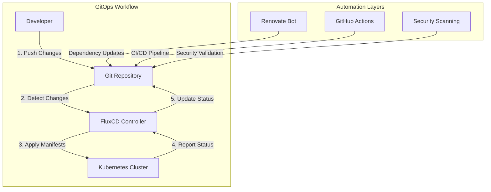

# 🔄 GitOps with FluxCD

This guide provides a comprehensive overview of our GitOps implementation using FluxCD, designed to automate infrastructure management, application deployment, and configuration drift prevention across our multi-environment Kubernetes homelab.

## 🎯 GitOps Philosophy

Our GitOps implementation follows the principles of **Infrastructure as Code** with Git as the single source of truth, enabling declarative management of the entire infrastructure stack.



### Core Principles

**Declarative**: Everything is described declaratively in Git repositories

```yaml
# Example: Declarative application deployment
apiVersion: apps/v1
kind: Deployment
metadata:
  name: demo-app
  namespace: staging
spec:
  replicas: 2
  selector:
    matchLabels:
      app: demo-app
  template:
    metadata:
      labels:
        app: demo-app
    spec:
      containers:
      - name: app
        image: nginx:1.21-alpine
        ports:
        - containerPort: 80
```

**Versioned**: All changes are tracked in Git with full audit trail

**Automated**: No manual kubectl apply or helm install commands

**Observable**: Full visibility into deployment status and health

## 🏗️ Repository Structure

Our GitOps repository follows a hierarchical structure optimized for multi-environment management:

```
k8s-cluster-config/
├── clusters/                    # Environment-specific configurations
│   ├── staging/                 # Staging environment
│   │   ├── flux-system/         # FluxCD bootstrap
│   │   ├── infrastructure.yaml  # Infrastructure dependencies
│   │   ├── monitoring.yaml      # Monitoring stack
│   │   ├── security.yaml        # Security tools
│   │   └── apps.yaml           # Applications
│   └── production/             # Production environment
│       ├── flux-system/        # FluxCD bootstrap
│       ├── infrastructure.yaml # Infrastructure dependencies
│       └── ...
├── infrastructure/             # Shared infrastructure components
│   ├── cert-manager/           # Certificate management
│   ├── metallb/               # Load balancing
│   ├── longhorn/              # Distributed storage
│   ├── traefik/               # Ingress controller
│   └── dns-blocky/            # DNS filtering
├── monitoring/                 # Observability stack
│   ├── prometheus/            # Metrics collection
│   ├── grafana/               # Visualization
│   ├── alertmanager/          # Alert routing
│   └── uptime-kuma/           # Uptime monitoring
├── security/                   # Security tooling
│   ├── trivy/                 # Vulnerability scanning
│   └── polaris/               # Policy validation
├── apps/                      # Application deployments
│   ├── demo-app/              # Sample applications
│   └── docs/                  # Documentation site
└── automation/                # GitOps automation
    ├── image-automation/      # Image update automation
    └── policies/              # Update policies
```

## 🚀 FluxCD Installation & Bootstrap

### Prerequisites

**Required Tools**:
```bash
# Install Flux CLI
curl -s https://fluxcd.io/install.sh | sudo bash

# Verify installation
flux --version

# Check cluster readiness
flux check --pre
```

### Bootstrap Process

**Staging Environment Bootstrap**:

```bash
#!/bin/bash
# Bootstrap staging cluster with FluxCD

set -euo pipefail

# Configuration
GITHUB_USER="johanhallberg"
GITHUB_REPO="k8s-cluster-config"
GITHUB_TOKEN="${GITHUB_TOKEN}"  # Set as environment variable
CLUSTER_NAME="staging"

# Validate prerequisites
echo "🔍 Validating prerequisites..."
flux check --pre

# Bootstrap FluxCD
echo "🚀 Bootstrapping FluxCD on $CLUSTER_NAME cluster..."
flux bootstrap github \
  --owner=$GITHUB_USER \
  --repository=$GITHUB_REPO \
  --branch=main \
  --path="./clusters/$CLUSTER_NAME" \
  --personal \
  --token-auth

# Verify bootstrap
echo "✅ Verifying FluxCD installation..."
kubectl wait --for=condition=ready pod -l app=source-controller -n flux-system --timeout=300s
kubectl wait --for=condition=ready pod -l app=kustomize-controller -n flux-system --timeout=300s
kubectl wait --for=condition=ready pod -l app=helm-controller -n flux-system --timeout=300s
kubectl wait --for=condition=ready pod -l app=notification-controller -n flux-system --timeout=300s

echo "🎉 FluxCD bootstrap completed successfully!"
echo "📊 Monitor reconciliation: flux get kustomizations"
```

### Bootstrap Validation

**Check FluxCD Status**:

```bash
# Verify all controllers are running
kubectl get pods -n flux-system

# Check source synchronization
flux get sources git

# Monitor kustomization status
flux get kustomizations

# View reconciliation logs
flux logs --all-namespaces --follow
```

## 🔄 Reconciliation Strategy

### Automatic Reconciliation

**FluxCD Configuration**: Optimized for homelab with balanced frequency

```yaml
# GitRepository configuration
apiVersion: source.toolkit.fluxcd.io/v1
kind: GitRepository
metadata:
  name: k8s-cluster-config
  namespace: flux-system
spec:
  interval: 1m                    # Check for changes every minute
  ref:
    branch: main
  secretRef:
    name: github-token
  url: https://github.com/johanhallberg/k8s-cluster-config
---
# Kustomization for infrastructure
apiVersion: kustomize.toolkit.fluxcd.io/v1
kind: Kustomization
metadata:
  name: infrastructure
  namespace: flux-system
spec:
  interval: 10m                   # Reconcile every 10 minutes
  retryInterval: 2m               # Retry failed reconciliations
  timeout: 5m                     # Timeout for operations
  sourceRef:
    kind: GitRepository
    name: k8s-cluster-config
  path: "./infrastructure"
  prune: true                     # Remove resources not in Git
  wait: true                      # Wait for readiness
  validation: client              # Client-side validation
```

### Dependency Management

**Hierarchical Dependencies**: Ensures proper deployment order

```yaml
# Infrastructure dependencies
apiVersion: kustomize.toolkit.fluxcd.io/v1
kind: Kustomization
metadata:
  name: infrastructure-traefik
  namespace: flux-system
spec:
  interval: 10m
  sourceRef:
    kind: GitRepository
    name: k8s-cluster-config
  path: "./infrastructure/traefik"
  dependsOn:
  - name: infrastructure-metallb    # Wait for load balancer
  - name: infrastructure-cert-manager  # Wait for certificate management
  prune: true
  wait: true
---
# Application dependencies
apiVersion: kustomize.toolkit.fluxcd.io/v1
kind: Kustomization
metadata:
  name: apps-demo
  namespace: flux-system
spec:
  interval: 5m
  sourceRef:
    kind: GitRepository
    name: k8s-cluster-config
  path: "./apps/demo-app/staging"
  dependsOn:
  - name: infrastructure-traefik   # Wait for ingress
  - name: monitoring               # Wait for monitoring
  prune: true
  wait: true
```

## 🛠️ Multi-Environment Management

### Environment Isolation

**Directory Structure**: Clear separation of environments

```
clusters/
├── staging/
│   ├── kustomization.yaml      # Environment orchestration
│   ├── infrastructure.yaml    # Infrastructure overlay
│   ├── monitoring.yaml        # Monitoring configuration
│   └── apps.yaml             # Application deployments
└── production/
    ├── kustomization.yaml      # Production orchestration
    ├── infrastructure.yaml    # Production infrastructure
    ├── monitoring.yaml        # Production monitoring
    └── apps.yaml             # Production applications
```

**Environment-Specific Configuration**:

```yaml
# staging/kustomization.yaml
apiVersion: kustomize.config.k8s.io/v1beta1
kind: Kustomization
metadata:
  name: staging-cluster
resources:
- infrastructure.yaml
- monitoring.yaml
- security.yaml
- apps.yaml

commonLabels:
  environment: staging
  cluster: kubestaging

namespace: staging

patchesStrategicMerge:
- patches/resource-limits.yaml      # Staging resource constraints
- patches/replica-counts.yaml       # Single replica for staging
```

### Configuration Overlays

**Kustomize Integration**: Environment-specific customizations

```yaml
# Base application configuration
# apps/demo-app/base/deployment.yaml
apiVersion: apps/v1
kind: Deployment
metadata:
  name: demo-app
spec:
  replicas: 1  # Will be overridden by environment
  template:
    spec:
      containers:
      - name: app
        image: nginx:1.21-alpine
        resources:
          requests:
            cpu: 50m
            memory: 64Mi
          limits:
            cpu: 100m
            memory: 128Mi
---
# Staging overlay
# apps/demo-app/staging/kustomization.yaml
apiVersion: kustomize.config.k8s.io/v1beta1
kind: Kustomization
namespace: staging
resources:
- ../base
replicas:
- name: demo-app
  count: 1
images:
- name: nginx
  newTag: 1.21-alpine
---
# Production overlay
# apps/demo-app/production/kustomization.yaml
apiVersion: kustomize.config.k8s.io/v1beta1
kind: Kustomization
namespace: production
resources:
- ../base
replicas:
- name: demo-app
  count: 3
images:
- name: nginx
  newTag: 1.21-alpine
patchesStrategicMerge:
- patches/production-resources.yaml  # Higher resource limits
```

## 🔐 Secret Management

### Kubernetes Secrets

**SOPS Integration**: Encrypted secrets in Git

```yaml
# Example encrypted secret
apiVersion: v1
kind: Secret
metadata:
    name: cloudflare-credentials
    namespace: traefik-system
type: Opaque
data:
    email: ENC[AES256_GCM,data:LKjHGFDSA...]
    token: ENC[AES256_GCM,data:ZXCVBNMqw...]
sops:
    kms: []
    gcp_kms: []
    azure_kv: []
    hc_vault: []
    age:
        - recipient: age1xyz...
          enc: |
            -----BEGIN AGE ENCRYPTED FILE-----
            ...
            -----END AGE ENCRYPTED FILE-----
    lastmodified: "2025-01-15T10:30:00Z"
    mac: ENC[AES256_GCM,data:abc123...]
    pgp: []
    version: 3.7.3
```

**Secret Sources**: Multiple secret management approaches

```yaml
# External Secrets Operator (planned)
apiVersion: external-secrets.io/v1beta1
kind: SecretStore
metadata:
  name: vault-backend
  namespace: flux-system
spec:
  provider:
    vault:
      server: "https://vault.local.hallonen.se"
      path: "secret"
      version: "v2"
      auth:
        kubernetes:
          mountPath: "kubernetes"
          role: "external-secrets"
---
apiVersion: external-secrets.io/v1beta1
kind: ExternalSecret
metadata:
  name: api-credentials
  namespace: applications
spec:
  refreshInterval: 15s
  secretStoreRef:
    name: vault-backend
    kind: SecretStore
  target:
    name: api-credentials
    creationPolicy: Owner
  data:
  - secretKey: username
    remoteRef:
      key: api-credentials
      property: username
  - secretKey: password
    remoteRef:
      key: api-credentials
      property: password
```

## 🤖 Automation & Image Updates

### Automated Image Updates

**Image Automation Controller**: Automatic container image updates

```yaml
# Image repository configuration
apiVersion: image.toolkit.fluxcd.io/v1beta2
kind: ImageRepository
metadata:
  name: nginx
  namespace: flux-system
spec:
  image: nginx
  interval: 5m
  provider: generic
---
# Image policy configuration
apiVersion: image.toolkit.fluxcd.io/v1beta2
kind: ImagePolicy
metadata:
  name: nginx-policy
  namespace: flux-system
spec:
  imageRepositoryRef:
    name: nginx
  policy:
    semver:
      range: '^1.21.x'  # Stay within 1.21.x versions
  filterTags:
    pattern: '^(?P<ts>.*)-alpine$'  # Only alpine variants
    extract: '$ts'
---
# Image update automation
apiVersion: image.toolkit.fluxcd.io/v1beta1
kind: ImageUpdateAutomation
metadata:
  name: flux-system
  namespace: flux-system
spec:
  interval: 30m
  sourceRef:
    kind: GitRepository
    name: k8s-cluster-config
  git:
    checkout:
      ref:
        branch: main
    commit:
      author:
        email: fluxcdbot@users.noreply.github.com
        name: fluxcdbot
      messageTemplate: |
        Automated image update
        
        Automation name: {{ .AutomationObject }}
        
        Files:
        {{ range $filename, $_ := .Updated.Files -}}
        - {{ $filename }}
        {{ end -}}
        
        Objects:
        {{ range $resource, $_ := .Updated.Objects -}}
        - {{ $resource.Kind }} {{ $resource.Name }}
        {{ end -}}
    push:
      branch: main
  update:
    path: "./apps"
    strategy: Setters
```

### Renovate Integration

**Dependency Management**: Automated updates for Helm charts, Docker images, and dependencies

```json
{
  "$schema": "https://docs.renovatebot.com/renovate-schema.json",
  "extends": [
    "config:base",
    "docker:enableMajor",
    ":disableRateLimiting",
    ":dependencyDashboard",
    ":semanticCommits",
    ":separatePatchReleases"
  ],
  "platform": "github",
  "includeForks": true,
  "dependencyDashboard": true,
  "dependencyDashboardTitle": "Renovate Dashboard 🤖",
  "suppressNotifications": ["prIgnoreNotification"],
  "rebaseWhen": "conflicted",
  "helm-values": {
    "fileMatch": ["(^|/)values\\.ya?ml$"]
  },
  "kubernetes": {
    "fileMatch": [
      "(^|/).*\\.ya?ml$"
    ],
    "ignorePaths": [
      ".github"
    ]
  },
  "regexManagers": [
    {
      "fileMatch": ["(^|/).*\\.ya?ml$"],
      "matchStrings": [
        "# renovate: datasource=(?<datasource>\\S+) depName=(?<depName>\\S+)( versioning=(?<versioning>\\S+))?\\s*\\w+:\\s*(?<currentValue>\\S+)"
      ],
      "versioningTemplate": "{{#if versioning}}{{{versioning}}}{{else}}semver{{/if}}"
    }
  ],
  "packageRules": [
    {
      "description": "Staging environment - aggressive updates",
      "matchFileNames": ["clusters/staging/**"],
      "automerge": true,
      "automergeType": "pr",
      "schedule": ["after 10pm every weekday", "before 5am every weekday", "every weekend"]
    },
    {
      "description": "Production environment - conservative updates",
      "matchFileNames": ["clusters/production/**"],
      "automerge": false,
      "schedule": ["after 10pm on sunday"]
    },
    {
      "description": "Security updates - immediate",
      "matchCategories": ["security"],
      "automerge": true,
      "schedule": ["at any time"]
    }
  ]
}
```

## 📊 Monitoring & Observability

### FluxCD Monitoring

**Prometheus Integration**: Comprehensive GitOps metrics

```yaml
# FluxCD monitoring configuration
apiVersion: monitoring.coreos.com/v1
kind: ServiceMonitor
metadata:
  name: flux-system
  namespace: flux-system
spec:
  selector:
    matchLabels:
      app.kubernetes.io/part-of: flux
  endpoints:
  - port: http-prom
    interval: 30s
    path: /metrics
    honorLabels: true
---
# Grafana dashboard for FluxCD
apiVersion: v1
kind: ConfigMap
metadata:
  name: flux-cluster-stats
  namespace: monitoring
  labels:
    grafana_dashboard: "1"
data:
  flux-cluster-stats.json: |
    {
      "dashboard": {
        "title": "Flux Cluster Stats",
        "panels": [
          {
            "title": "Reconciliation Status",
            "type": "stat",
            "targets": [
              {
                "expr": "gotk_reconcile_condition{type=\"Ready\",status=\"True\"}",
                "legendFormat": "Ready"
              }
            ]
          },
          {
            "title": "Reconciliation Duration",
            "type": "timeseries",
            "targets": [
              {
                "expr": "gotk_reconcile_duration_seconds",
                "legendFormat": "{{exported_namespace}}/{{name}}"
              }
            ]
          }
        ]
      }
    }
```

### Alert Configuration

**Critical GitOps Alerts**: Monitoring for reconciliation failures

```yaml
# FluxCD alert rules
apiVersion: monitoring.coreos.com/v1
kind: PrometheusRule
metadata:
  name: flux-alerts
  namespace: flux-system
spec:
  groups:
  - name: flux
    rules:
    - alert: FluxReconciliationFailure
      expr: max(gotk_reconcile_condition{type="Ready",status="False"}) by (exported_namespace, name, type) == 1
      for: 10m
      labels:
        severity: critical
      annotations:
        summary: "Flux reconciliation failure"
        description: "{{ $labels.exported_namespace }}/{{ $labels.name }} reconciliation has been failing for more than 10 minutes."
    
    - alert: FluxSuspendedResource
      expr: max(gotk_suspend_status) by (exported_namespace, name, type) == 1
      for: 5m
      labels:
        severity: warning
      annotations:
        summary: "Flux resource suspended"
        description: "{{ $labels.exported_namespace }}/{{ $labels.name }} has been suspended."
    
    - alert: FluxReconciliationStalled
      expr: increase(gotk_reconcile_duration_seconds[5m]) == 0
      for: 15m
      labels:
        severity: warning
      annotations:
        summary: "Flux reconciliation stalled"
        description: "{{ $labels.exported_namespace }}/{{ $labels.name }} has not reconciled in the last 15 minutes."
```

## 🔍 Troubleshooting GitOps

### Common Issues

**Reconciliation Failures**:

```bash
# Check overall GitOps health
flux get all --all-namespaces

# View specific resource status
flux get kustomizations --watch

# Check for suspension (often after failures)
flux get sources git
flux get kustomizations

# Resume suspended resources
flux resume kustomization infrastructure
```

**Resource Conflicts**:

```bash
# Force reconciliation
flux reconcile kustomization infrastructure --with-source

# Check for resource conflicts
kubectl get events --sort-by='.lastTimestamp' -A

# View detailed logs
flux logs --level=error --all-namespaces
```

**Image Update Issues**:

```bash
# Check image automation status
flux get image all

# Verify image policies
kubectl describe imagepolicy -n flux-system

# Check repository connectivity
kubectl describe imagerepository -n flux-system
```

### Emergency Procedures

**Disaster Recovery**:

1. **Assessment**: Check what's failing
   ```bash
   flux get all --all-namespaces
   kubectl get pods --all-namespaces | grep -v Running
   ```

2. **Suspend Automation**: Prevent further changes
   ```bash
   flux suspend kustomization --all
   ```

3. **Manual Recovery**: Apply known-good state
   ```bash
   git checkout LAST_KNOWN_GOOD_COMMIT
   kubectl apply -k clusters/staging/
   ```

4. **Resume Automation**: Restart GitOps
   ```bash
   flux resume kustomization --all
   ```

## 🚀 Advanced Patterns

### Canary Deployments

**Flagger Integration**: Progressive delivery with automated rollbacks

```yaml
# Canary deployment configuration
apiVersion: flagger.app/v1beta1
kind: Canary
metadata:
  name: demo-app
  namespace: staging
spec:
  targetRef:
    apiVersion: apps/v1
    kind: Deployment
    name: demo-app
  progressDeadlineSeconds: 60
  service:
    port: 80
    targetPort: 80
  analysis:
    interval: 1m
    threshold: 5
    maxWeight: 50
    stepWeight: 10
    metrics:
    - name: request-success-rate
      thresholdRange:
        min: 99
      interval: 1m
    - name: request-duration
      thresholdRange:
        max: 500
      interval: 30s
    webhooks:
    - name: acceptance-test
      type: pre-rollout
      url: http://flagger-loadtester.test/
      timeout: 30s
      metadata:
        type: bash
        cmd: "curl -sd 'test' http://demo-app-canary.staging/token | grep token"
    - name: load-test
      url: http://flagger-loadtester.test/
      timeout: 5s
      metadata:
        cmd: "hey -z 1m -q 10 -c 2 http://demo-app-canary.staging/"
```

### Multi-Cluster Management

**Cluster API Integration**: Managing multiple clusters declaratively

```yaml
# Cluster management with Cluster API (future)
apiVersion: cluster.x-k8s.io/v1beta1
kind: Cluster
metadata:
  name: production-cluster
  namespace: default
spec:
  clusterNetwork:
    pods:
      cidrBlocks: ["10.42.0.0/16"]
    services:
      cidrBlocks: ["10.43.0.0/16"]
  infrastructureRef:
    apiVersion: infrastructure.cluster.x-k8s.io/v1beta1
    kind: TalosControlPlane
    name: production-cluster
  controlPlaneRef:
    kind: TalosControlPlane
    apiVersion: controlplane.cluster.x-k8s.io/v1beta1
    name: production-cluster
```

## 📈 Best Practices

### Repository Management

**Branch Strategy**: Simplified Git workflow

- **main**: Production-ready state
- **feature/**: Development branches
- **hotfix/**: Emergency fixes

**Commit Messages**: Semantic commit conventions

```
feat(monitoring): add Grafana ARM64 dashboards
fix(traefik): resolve certificate renewal issue
docs(gitops): update FluxCD configuration examples
chore(deps): bump prometheus to v2.40.0
```

### Security Considerations

**Access Control**: Principle of least privilege

```yaml
# FluxCD service account with minimal permissions
apiVersion: rbac.authorization.k8s.io/v1
kind: ClusterRole
metadata:
  name: flux-readonly
rules:
- apiGroups: [""]
  resources: ["namespaces", "configmaps", "secrets"]
  verbs: ["get", "list", "watch"]
- apiGroups: ["apps"]
  resources: ["deployments", "replicasets"]
  verbs: ["get", "list", "watch", "create", "update", "patch"]
```

**Secret Rotation**: Automated credential management

```bash
# Automated secret rotation script
#!/bin/bash
# Rotate GitHub token for FluxCD

NEW_TOKEN=$(generate-new-github-token)
kubectl create secret generic github-token \
  --from-literal=token=$NEW_TOKEN \
  --dry-run=client -o yaml | \
  kubectl apply -f -

# Restart FluxCD to pick up new token
kubectl rollout restart deployment -n flux-system
```

### Performance Optimization

**Resource Tuning**: Optimized for ARM64 hardware

```yaml
# FluxCD resource optimization
apiVersion: v1
kind: ConfigMap
metadata:
  name: flux-system-config
  namespace: flux-system
data:
  config.yaml: |
    # Source controller configuration
    source-controller:
      resources:
        limits:
          cpu: 500m
          memory: 256Mi
        requests:
          cpu: 100m
          memory: 128Mi
    
    # Kustomize controller configuration
    kustomize-controller:
      resources:
        limits:
          cpu: 500m
          memory: 256Mi
        requests:
          cpu: 100m
          memory: 128Mi
      concurrency: 2  # Limit concurrent reconciliations
```

---

This GitOps implementation provides a robust foundation for managing Kubernetes infrastructure and applications with full automation, observability, and security while maintaining the flexibility needed for a learning-focused homelab environment.
