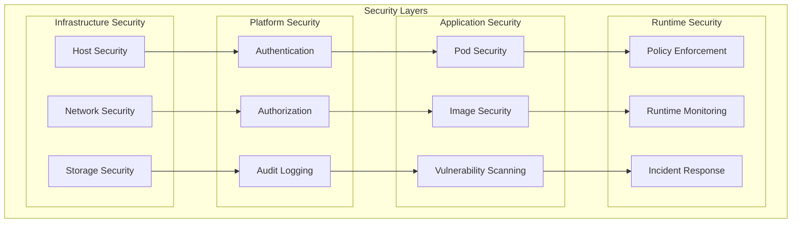
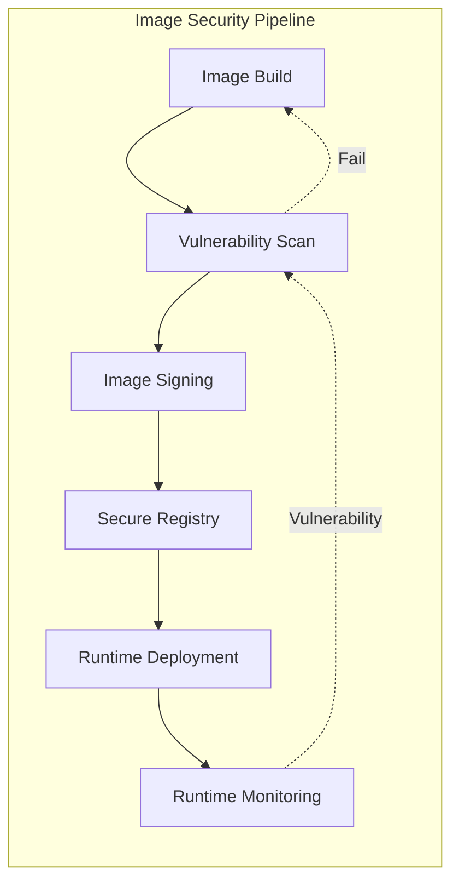

# 🔒 Kubernetes Security

This comprehensive guide covers the multi-layered security approach implemented in our homelab Kubernetes environment, focusing on defense-in-depth principles, compliance standards, and automated security validation.

## 🎯 Security Philosophy

Our security strategy follows the principle of **defense-in-depth** with multiple layers of protection:



## 🔐 Authentication & Authorization

### Kubernetes RBAC

**Role-Based Access Control**: Implementing principle of least privilege

```yaml
# Service account for monitoring components
apiVersion: v1
kind: ServiceAccount
metadata:
  name: monitoring-sa
  namespace: monitoring
automountServiceAccountToken: true
---
# ClusterRole with minimal permissions
apiVersion: rbac.authorization.k8s.io/v1
kind: ClusterRole
metadata:
  name: monitoring-reader
rules:
- apiGroups: [""]
  resources: ["nodes", "nodes/metrics", "services", "endpoints", "pods"]
  verbs: ["get", "list", "watch"]
- apiGroups: ["apps"]
  resources: ["deployments", "replicasets", "daemonsets"]
  verbs: ["get", "list", "watch"]
- nonResourceURLs: ["/metrics"]
  verbs: ["get"]
---
# ClusterRoleBinding
apiVersion: rbac.authorization.k8s.io/v1
kind: ClusterRoleBinding
metadata:
  name: monitoring-reader
roleRef:
  apiGroup: rbac.authorization.k8s.io
  kind: ClusterRole
  name: monitoring-reader
subjects:
- kind: ServiceAccount
  name: monitoring-sa
  namespace: monitoring
```

### Pod Security Standards

**Restricted Security Context**: Default security posture for all workloads

```yaml
# Namespace with Pod Security Standards enforced
apiVersion: v1
kind: Namespace
metadata:
  name: secure-applications
  labels:
    # Enforce restricted security standards
    pod-security.kubernetes.io/enforce: restricted
    pod-security.kubernetes.io/audit: restricted
    pod-security.kubernetes.io/warn: restricted
    # Exception for specific workloads if needed
    pod-security.kubernetes.io/enforce-version: v1.24
---
# Example secure deployment
apiVersion: apps/v1
kind: Deployment
metadata:
  name: secure-app
  namespace: secure-applications
spec:
  replicas: 2
  selector:
    matchLabels:
      app: secure-app
  template:
    metadata:
      labels:
        app: secure-app
    spec:
      serviceAccountName: app-service-account
      securityContext:
        runAsNonRoot: true
        runAsUser: 1000
        runAsGroup: 3000
        fsGroup: 2000
        seccompProfile:
          type: RuntimeDefault
      containers:
      - name: app
        image: nginx:1.21-alpine
        securityContext:
          allowPrivilegeEscalation: false
          readOnlyRootFilesystem: true
          capabilities:
            drop:
            - ALL
          runAsNonRoot: true
          runAsUser: 1000
        ports:
        - containerPort: 8080
        resources:
          requests:
            cpu: 100m
            memory: 128Mi
          limits:
            cpu: 500m
            memory: 256Mi
        volumeMounts:
        - name: tmp
          mountPath: /tmp
        - name: var-cache
          mountPath: /var/cache/nginx
        - name: var-run
          mountPath: /var/run
      volumes:
      - name: tmp
        emptyDir: {}
      - name: var-cache
        emptyDir: {}
      - name: var-run
        emptyDir: {}
```

### Network Policies

**Zero-Trust Networking**: Default deny with explicit allow rules

```yaml
# Default deny all network policy
apiVersion: networking.k8s.io/v1
kind: NetworkPolicy
metadata:
  name: default-deny-all
  namespace: secure-applications
spec:
  podSelector: {}
  policyTypes:
  - Ingress
  - Egress
---
# Allow specific communication patterns
apiVersion: networking.k8s.io/v1
kind: NetworkPolicy
metadata:
  name: allow-web-to-api
  namespace: secure-applications
spec:
  podSelector:
    matchLabels:
      tier: api
  policyTypes:
  - Ingress
  ingress:
  - from:
    - podSelector:
        matchLabels:
          tier: web
    ports:
    - protocol: TCP
      port: 8080
---
# Allow egress to external services
apiVersion: networking.k8s.io/v1
kind: NetworkPolicy
metadata:
  name: allow-api-egress
  namespace: secure-applications
spec:
  podSelector:
    matchLabels:
      tier: api
  policyTypes:
  - Egress
  egress:
  - to: []  # Allow all egress (customize as needed)
    ports:
    - protocol: TCP
      port: 443
    - protocol: TCP
      port: 80
  # Allow DNS resolution
  - to:
    - namespaceSelector:
        matchLabels:
          name: kube-system
    ports:
    - protocol: UDP
      port: 53
```

## 🛡️ Vulnerability Scanning

### Trivy Operator

**Automated Security Scanning**: Continuous vulnerability assessment

```yaml
# Trivy Operator configuration
apiVersion: aquasecurity.github.io/v1alpha1
kind: TrivyOperator
metadata:
  name: trivy-operator
  namespace: trivy-system
spec:
  vulnerabilityReportsPlugin: "Trivy"
  configAuditReportsPlugin: "Trivy"
  exposeSecretReportsPlugin: "Trivy"
  scanJobTimeout: 5m
  concurrent:
    limit: 10
  vulnerabilityReports:
    scanner:
      name: Trivy
      vendor: Aqua Security
      version: "0.35.0"
  configAuditReports:
    scanner:
      name: Trivy
      vendor: Aqua Security
      version: "0.35.0"
---
# ClusterVulnerabilityReport for cluster-wide scanning
apiVersion: aquasecurity.github.io/v1alpha1
kind: ClusterVulnerabilityReport
metadata:
  name: cluster-vuln-report
spec:
  updateTimestamp: "2024-01-15T10:00:00Z"
  scanner:
    name: Trivy
    vendor: Aqua Security
    version: "0.35.0"
  registry:
    server: docker.io
  artifact:
    repository: library/nginx
    tag: "1.21-alpine"
  summary:
    criticalCount: 0
    highCount: 2
    mediumCount: 5
    lowCount: 10
    unknownCount: 0
```

### CIS Kubernetes Benchmark

**Compliance Scanning**: Automated compliance validation

```yaml
# CIS Kubernetes Benchmark job
apiVersion: batch/v1
kind: Job
metadata:
  name: cis-benchmark
  namespace: security
spec:
  template:
    spec:
      hostPID: true
      hostIPC: true
      hostNetwork: true
      containers:
      - name: kube-bench
        image: aquasec/kube-bench:v0.6.10
        command: ["kube-bench"]
        args: ["--config-dir=/opt/kube-bench/cfg/", "--config=/opt/kube-bench/cfg/config.yaml"]
        volumeMounts:
        - name: var-lib-etcd
          mountPath: /var/lib/etcd
          readOnly: true
        - name: var-lib-kubelet
          mountPath: /var/lib/kubelet
          readOnly: true
        - name: etc-systemd
          mountPath: /etc/systemd
          readOnly: true
        - name: etc-kubernetes
          mountPath: /etc/kubernetes
          readOnly: true
        - name: usr-bin
          mountPath: /usr/local/mount-from-host/bin
          readOnly: true
      restartPolicy: Never
      volumes:
      - name: var-lib-etcd
        hostPath:
          path: "/var/lib/etcd"
      - name: var-lib-kubelet
        hostPath:
          path: "/var/lib/kubelet"
      - name: etc-systemd
        hostPath:
          path: "/etc/systemd"
      - name: etc-kubernetes
        hostPath:
          path: "/etc/kubernetes"
      - name: usr-bin
        hostPath:
          path: "/usr/bin"
```

## 📜 Policy Enforcement

### Polaris Validation

**Best Practices Enforcement**: Automated policy validation

```yaml
# Polaris configuration
apiVersion: v1
kind: ConfigMap
metadata:
  name: polaris-config
  namespace: polaris
data:
  config.yaml: |
    checks:
      # Security checks
      runAsNonRoot: danger
      runAsPrivileged: danger
      notReadOnlyRootFilesystem: warning
      privilegeEscalationAllowed: danger
      
      # Resource checks
      cpuRequestsMissing: warning
      cpuLimitsMissing: warning
      memoryRequestsMissing: warning
      memoryLimitsMissing: warning
      
      # Reliability checks
      deploymentMissingReplicas: warning
      priorityClassNotSet: ignore
      tagNotSpecified: danger
      pullPolicyNotAlways: ignore
      
      # Networking checks
      hostNetworkSet: danger
      hostPortSet: warning
    
    exemptions:
      - namespace: kube-system
      - namespace: polaris
      - namespace: flux-system
      
    controllers_to_scan:
      - Deployments
      - DaemonSets
      - StatefulSets
      - Jobs
      - CronJobs
      - ReplicationControllers
---
# Polaris webhook admission controller
apiVersion: admissionregistration.k8s.io/v1
kind: ValidatingAdmissionWebhook
metadata:
  name: polaris-webhook
webhooks:
- name: polaris.fairwinds.com
  clientConfig:
    service:
      name: polaris-webhook
      namespace: polaris
      path: "/validate"
  rules:
  - operations: ["CREATE", "UPDATE"]
    apiGroups: ["apps"]
    apiVersions: ["v1"]
    resources: ["deployments", "daemonsets", "statefulsets"]
  - operations: ["CREATE", "UPDATE"]
    apiGroups: ["batch"]
    apiVersions: ["v1"]
    resources: ["jobs", "cronjobs"]
  admissionReviewVersions: ["v1", "v1beta1"]
  sideEffects: None
  failurePolicy: Fail
```

### OPA Gatekeeper (Planned)

**Advanced Policy Engine**: Custom policy enforcement

```yaml
# Gatekeeper constraint template
apiVersion: templates.gatekeeper.sh/v1beta1
kind: ConstraintTemplate
metadata:
  name: k8srequiredlabels
spec:
  crd:
    spec:
      names:
        kind: K8sRequiredLabels
      validation:
        openAPIV3Schema:
          type: object
          properties:
            labels:
              type: array
              items:
                type: string
  targets:
    - target: admission.k8s.gatekeeper.sh
      rego: |
        package k8srequiredlabels
        
        violation[{"msg": msg}] {
          required := input.parameters.labels
          provided := input.review.object.metadata.labels
          missing := required[_]
          not provided[missing]
          msg := sprintf("You must provide labels: %v", [missing])
        }
---
# Constraint using the template
apiVersion: constraints.gatekeeper.sh/v1beta1
kind: K8sRequiredLabels
metadata:
  name: must-have-environment
spec:
  match:
    kinds:
      - apiGroups: ["apps"]
        kinds: ["Deployment"]
    namespaces: ["production"]
  parameters:
    labels: ["environment", "team", "version"]
```

## 🔍 Image Security

### Image Scanning Pipeline

**Automated Image Validation**: Multi-stage security validation



**Admission Controller for Image Policies**:

```yaml
# Image policy enforcement
apiVersion: kyverno.io/v1
kind: ClusterPolicy
metadata:
  name: require-image-signature
spec:
  validationFailureAction: enforce
  background: false
  rules:
  - name: check-image-signature
    match:
      any:
      - resources:
          kinds:
          - Pod
          - Deployment
          - StatefulSet
          - DaemonSet
    verifyImages:
    - imageReferences:
      - "*"
      attestors:
      - count: 1
        entries:
        - keys:
            publicKeys: |-
              -----BEGIN PUBLIC KEY-----
              MFkwEwYHKoZIzj0CAQYIKoZIzj0DAQcDQgAE8nXRh950IZbRj8Ra/N9sbqOPZrfM
              5/KAQN0/KjHcorm/J5yctVd7iEcnessRQjU917hmKO6JWVGHpDguIyakZA==
              -----END PUBLIC KEY-----
---
# Restrict container registries
apiVersion: kyverno.io/v1
kind: ClusterPolicy
metadata:
  name: restrict-image-registries
spec:
  validationFailureAction: enforce
  background: true
  rules:
  - name: validate-registries
    match:
      any:
      - resources:
          kinds:
          - Pod
    validate:
      message: "Images must come from approved registries"
      pattern:
        spec:
          containers:
          - image: "docker.io/*|quay.io/*|gcr.io/*|registry.k8s.io/*"
```

## 📊 Security Monitoring

### Security Metrics

**Prometheus Security Metrics**: Monitoring security posture

```yaml
# Security monitoring ServiceMonitor
apiVersion: monitoring.coreos.com/v1
kind: ServiceMonitor
metadata:
  name: security-metrics
  namespace: monitoring
spec:
  selector:
    matchLabels:
      app.kubernetes.io/name: trivy-operator
  endpoints:
  - port: metrics
    interval: 30s
    path: /metrics
---
# Security alert rules
apiVersion: monitoring.coreos.com/v1
kind: PrometheusRule
metadata:
  name: security-alerts
  namespace: monitoring
spec:
  groups:
  - name: security
    rules:
    - alert: HighSeverityVulnerabilities
      expr: trivy_vulnerability_id{severity="HIGH"} > 0
      for: 5m
      labels:
        severity: warning
      annotations:
        summary: "High severity vulnerabilities detected"
        description: "{{ $labels.namespace }}/{{ $labels.name }} has {{ $value }} high severity vulnerabilities"
    
    - alert: CriticalSeverityVulnerabilities
      expr: trivy_vulnerability_id{severity="CRITICAL"} > 0
      for: 0m
      labels:
        severity: critical
      annotations:
        summary: "Critical severity vulnerabilities detected"
        description: "{{ $labels.namespace }}/{{ $labels.name }} has {{ $value }} critical severity vulnerabilities"
    
    - alert: PolicyViolationDetected
      expr: polaris_validation_errors > 0
      for: 2m
      labels:
        severity: warning
      annotations:
        summary: "Policy violation detected"
        description: "{{ $labels.namespace }}/{{ $labels.name }} has policy violations"
```

### Audit Logging

**Kubernetes Audit Configuration**: Comprehensive audit trail

```yaml
# Audit policy configuration
apiVersion: audit.k8s.io/v1
kind: Policy
rules:
# Log security-related events at RequestResponse level
- level: RequestResponse
  namespaces: ["kube-system", "kube-public", "flux-system"]
  verbs: ["create", "update", "patch", "delete"]
  resources:
  - group: "rbac.authorization.k8s.io"
    resources: ["roles", "rolebindings", "clusterroles", "clusterrolebindings"]
  - group: ""
    resources: ["secrets", "serviceaccounts"]

# Log all authentication and authorization failures
- level: Request
  users: ["system:unauthenticated"]
  verbs: ["*"]

# Log workload creation/modification
- level: Request
  verbs: ["create", "update", "patch", "delete"]
  resources:
  - group: "apps"
    resources: ["deployments", "daemonsets", "statefulsets"]
  - group: ""
    resources: ["pods"]

# Log access to secrets
- level: Metadata
  verbs: ["get", "list", "watch"]
  resources:
  - group: ""
    resources: ["secrets"]

# Catch-all rule to log everything else at Metadata level
- level: Metadata
  omitStages:
  - RequestReceived
```

## 🛡️ Secret Management

### Kubernetes Secrets Best Practices

**Secure Secret Handling**: Encrypted storage and access control

```yaml
# Encrypted secret with SOPS
apiVersion: v1
kind: Secret
metadata:
  name: api-credentials
  namespace: secure-applications
type: Opaque
data:
  username: ENC[AES256_GCM,data:base64_encrypted_data...]
  password: ENC[AES256_GCM,data:base64_encrypted_data...]
sops:
  kms: []
  gcp_kms: []
  azure_kv: []
  hc_vault: []
  age:
    - recipient: age1ql3z7hjy54pw9hyww5ayyfg7zqgvc7w3j2elw8zmrj2kg5sfn9aqmcac8p
      enc: |
        -----BEGIN AGE ENCRYPTED FILE-----
        YWdlLWVuY3J5cHRpb24ub3JnL3YxCi0+IFgyNTUxOSByOUloSlJmZW1NZVZST3Fv
        ...
        -----END AGE ENCRYPTED FILE-----
  lastmodified: "2024-01-15T10:00:00Z"
  mac: ENC[AES256_GCM,data:encrypted_mac...]
  pgp: []
  version: 3.7.3
---
# External Secrets Operator integration (planned)
apiVersion: external-secrets.io/v1beta1
kind: ExternalSecret
metadata:
  name: vault-secret
  namespace: secure-applications
spec:
  refreshInterval: 30s
  secretStoreRef:
    name: vault-backend
    kind: SecretStore
  target:
    name: vault-secret
    creationPolicy: Owner
  data:
  - secretKey: password
    remoteRef:
      key: secret/data/database
      property: password
```

### Secret Rotation

**Automated Secret Rotation**: Regular credential updates

```bash
#!/bin/bash
# Automated secret rotation script

set -euo pipefail

NAMESPACE="secure-applications"
SECRET_NAME="api-credentials"

# Generate new credentials
NEW_PASSWORD=$(openssl rand -base64 32)
NEW_API_KEY=$(uuidgen)

# Update external system with new credentials
curl -X PUT "https://api.example.com/credentials" \
  -H "Content-Type: application/json" \
  -d "{
    \"password\": \"$NEW_PASSWORD\",
    \"api_key\": \"$NEW_API_KEY\"
  }"

# Update Kubernetes secret
kubectl create secret generic "$SECRET_NAME" \
  --namespace="$NAMESPACE" \
  --from-literal=password="$NEW_PASSWORD" \
  --from-literal=api_key="$NEW_API_KEY" \
  --dry-run=client -o yaml | \
  kubectl apply -f -

# Restart affected deployments
kubectl rollout restart deployment -n "$NAMESPACE" -l "uses-secret=$SECRET_NAME"

echo "Secret rotation completed successfully"
```

## 🚑 Incident Response

### Security Incident Playbook

**Incident Response Process**: Structured approach to security events

1. **Detection**: Automated alerts and monitoring
2. **Assessment**: Determine scope and severity
3. **Containment**: Isolate affected resources
4. **Investigation**: Analyze logs and evidence
5. **Recovery**: Restore normal operations
6. **Post-Incident**: Document and improve

**Emergency Response Commands**:

```bash
# Immediate containment commands

# Isolate a compromised pod
kubectl patch deployment compromised-app -p '{
  "spec": {
    "template": {
      "spec": {
        "nodeSelector": {
          "kubernetes.io/hostname": "quarantine-node"
        }
      }
    }
  }
}'

# Scale down suspicious deployment
kubectl scale deployment suspicious-app --replicas=0

# Apply emergency network policy
kubectl apply -f - <<EOF
apiVersion: networking.k8s.io/v1
kind: NetworkPolicy
metadata:
  name: emergency-isolation
  namespace: compromised-namespace
spec:
  podSelector: {}
  policyTypes:
  - Ingress
  - Egress
EOF

# Emergency secret rotation
kubectl delete secret compromised-secret
kubectl create secret generic compromised-secret --from-literal=key=new-value

# Collect forensic data
kubectl get events --sort-by='.firstTimestamp' -n compromised-namespace
kubectl logs -n compromised-namespace --previous compromised-pod
```

### Security Automation

**Automated Response**: Programmatic incident handling

```yaml
# Falco rule for detecting suspicious activity
apiVersion: v1
kind: ConfigMap
metadata:
  name: falco-rules
  namespace: falco
data:
  custom_rules.yaml: |
    - rule: Suspicious Container Activity
      desc: Detect suspicious process execution in containers
      condition: >
        spawned_process and 
        container and 
        proc.name in (nc, ncat, netcat, nmap, dig, nslookup, tcpdump)
      output: >
        Suspicious activity in container 
        (user=%user.name command=%proc.cmdline container=%container.name 
        image=%container.image.repository:%container.image.tag)
      priority: WARNING
      tags: [container, suspicious]
    
    - rule: Privileged Container Started
      desc: Detect privileged container execution
      condition: >
        container_started and 
        container.privileged=true
      output: >
        Privileged container started 
        (user=%user.name command=%proc.cmdline container=%container.name 
        image=%container.image.repository:%container.image.tag)
      priority: CRITICAL
      tags: [container, privilege_escalation]
```

## 📈 Security Metrics & KPIs

### Security Dashboard

**Key Security Indicators**: Monitoring security posture

```yaml
# Grafana dashboard for security metrics
apiVersion: v1
kind: ConfigMap
metadata:
  name: security-dashboard
  namespace: monitoring
  labels:
    grafana_dashboard: "1"
data:
  security-overview.json: |
    {
      "dashboard": {
        "title": "Security Overview",
        "panels": [
          {
            "title": "Critical Vulnerabilities",
            "type": "stat",
            "targets": [
              {
                "expr": "sum(trivy_vulnerability_id{severity=\"CRITICAL\"})",
                "legendFormat": "Critical Vulnerabilities"
              }
            ],
            "fieldConfig": {
              "defaults": {
                "thresholds": {
                  "steps": [
                    {"color": "green", "value": 0},
                    {"color": "red", "value": 1}
                  ]
                }
              }
            }
          },
          {
            "title": "Policy Violations",
            "type": "timeseries",
            "targets": [
              {
                "expr": "sum(rate(polaris_validation_errors[5m]))",
                "legendFormat": "Policy Violations/sec"
              }
            ]
          },
          {
            "title": "Failed Authentication Attempts",
            "type": "timeseries",
            "targets": [
              {
                "expr": "sum(rate(apiserver_audit_total{verb=\"create\",objectRef_resource=\"tokenreviews\",code!=\"201\"}[5m]))",
                "legendFormat": "Failed Auth/sec"
              }
            ]
          }
        ]
      }
    }
```

### Compliance Reporting

**Automated Compliance**: Regular compliance validation and reporting

```yaml
# CronJob for compliance reporting
apiVersion: batch/v1
kind: CronJob
metadata:
  name: security-compliance-report
  namespace: security
spec:
  schedule: "0 6 * * 1"  # Weekly on Monday at 6 AM
  jobTemplate:
    spec:
      template:
        spec:
          containers:
          - name: compliance-reporter
            image: security/compliance-reporter:latest
            command:
            - /bin/sh
            - -c
            - |
              # Generate CIS benchmark report
              kube-bench --json > /reports/cis-benchmark.json
              
              # Generate vulnerability report
              trivy k8s --report summary --format json cluster > /reports/vulnerability-scan.json
              
              # Generate policy compliance report
              polaris audit --format json > /reports/policy-compliance.json
              
              # Combine reports and send
              compliance-aggregator --output /reports/weekly-compliance-report.json
              report-sender --webhook "$DISCORD_WEBHOOK_URL" --file /reports/weekly-compliance-report.json
            env:
            - name: DISCORD_WEBHOOK_URL
              valueFrom:
                secretKeyRef:
                  name: notification-secrets
                  key: discord-webhook
            volumeMounts:
            - name: reports
              mountPath: /reports
          restartPolicy: OnFailure
          volumes:
          - name: reports
            emptyDir: {}
```

---

This comprehensive security framework provides multiple layers of protection, automated validation, and continuous monitoring to maintain a robust security posture in the Kubernetes homelab environment while enabling learning and experimentation with enterprise-grade security practices.
