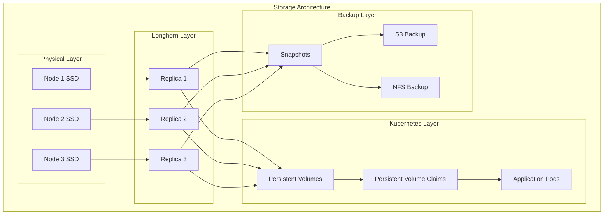

# 💾 Kubernetes Storage Management

This comprehensive guide covers persistent storage solutions in our homelab Kubernetes environment, focusing on Longhorn distributed storage, backup strategies, and data management best practices.

## 🎯 Storage Strategy

Our storage approach prioritizes:

- **High Availability**: Distributed storage across multiple nodes
- **Data Protection**: Automated backups and snapshots
- **Performance**: SSD-backed storage with intelligent caching
- **Scalability**: Dynamic provisioning and expansion
- **Disaster Recovery**: Cross-site replication capabilities



## 🏗️ Longhorn Distributed Storage

### Core Components

**Longhorn Manager**: Orchestrates storage operations and maintains cluster state

```yaml
apiVersion: longhorn.io/v1beta2
kind: Setting
metadata:
  name: default-replica-count
  namespace: longhorn-system
value: "3"  # Ensure 3 replicas for HA
---
apiVersion: longhorn.io/v1beta2
kind: Setting
metadata:
  name: default-data-locality
  namespace: longhorn-system
value: "best-effort"  # Try to keep one replica local
---
apiVersion: longhorn.io/v1beta2
kind: Setting
metadata:
  name: storage-over-provisioning-percentage
  namespace: longhorn-system
value: "200"  # Allow 200% overprovisioning
```

**Longhorn Engine**: Handles I/O operations and replication

```yaml
# Example Volume configuration
apiVersion: longhorn.io/v1beta2
kind: Volume
metadata:
  name: postgres-data
  namespace: longhorn-system
spec:
  size: "10Gi"
  numberOfReplicas: 3
  dataLocality: "best-effort"
  accessMode: "ReadWriteOnce"
  migratable: true
  encrypted: false
  dataSource: ""
  fromBackup: ""
  diskSelector: []
  nodeSelector: []
  recurringJobSelector:
  - name: backup-daily
    isGroup: false
```

### Storage Classes

**Default Storage Class**: General purpose storage

```yaml
apiVersion: storage.k8s.io/v1
kind: StorageClass
metadata:
  name: longhorn
  annotations:
    storageclass.kubernetes.io/is-default-class: "true"
provisioner: driver.longhorn.io
allowVolumeExpansion: true
reclaimPolicy: Delete
volumeBindingMode: Immediate
parameters:
  numberOfReplicas: "3"
  staleReplicaTimeout: "2880"  # 48 hours
  fromBackup: ""
  fsType: "ext4"
  dataLocality: "best-effort"
```

### Node Configuration

**Disk Management**: Configuring storage disks for Longhorn

```yaml
# Node disk configuration
apiVersion: longhorn.io/v1beta2
kind: Node
metadata:
  name: homelab-node-1
  namespace: longhorn-system
spec:
  allowScheduling: true
  evictionRequested: false
  tags:
    - "storage"
    - "ssd"
  disks:
    default-disk:
      allowScheduling: true
      evictionRequested: false
      path: "/var/lib/longhorn/"
      tags:
        - "default"
        - "ssd"
      storageReserved: 10737418240  # 10GB reserved
```

## 🔄 Backup and Recovery

### Automated Backup Jobs

**Daily Backup Configuration**:

```yaml
apiVersion: longhorn.io/v1beta2
kind: RecurringJob
metadata:
  name: backup-daily
  namespace: longhorn-system
spec:
  cron: "0 2 * * *"  # Daily at 2 AM
  task: "backup"
  groups:
  - "default"
  retain: 7  # Keep 7 daily backups
  concurrency: 2
  labels:
    interval: "daily"
```

### Volume Snapshots

**Manual Snapshot Creation**:

```bash
# Create manual snapshot
kubectl apply -f - <<EOF
apiVersion: longhorn.io/v1beta2
kind: Snapshot
metadata:
  name: postgres-manual-snapshot-$(date +%Y%m%d-%H%M%S)
  namespace: longhorn-system
spec:
  volume: postgres-data
  labels:
    type: "manual"
    purpose: "pre-upgrade"
EOF
```

### Disaster Recovery

**Cross-Cluster Backup Restoration**:

```yaml
# Restore from backup in different cluster
apiVersion: longhorn.io/v1beta2
kind: Volume
metadata:
  name: postgres-dr-restore
  namespace: longhorn-system
spec:
  size: "10Gi"
  numberOfReplicas: 3
  fromBackup: "s3://longhorn-backups@us-east-1/backups/backup_backup-daily-postgres-data_20241215-020000"
  dataSource: ""
```

## 📊 Performance Optimization

...
