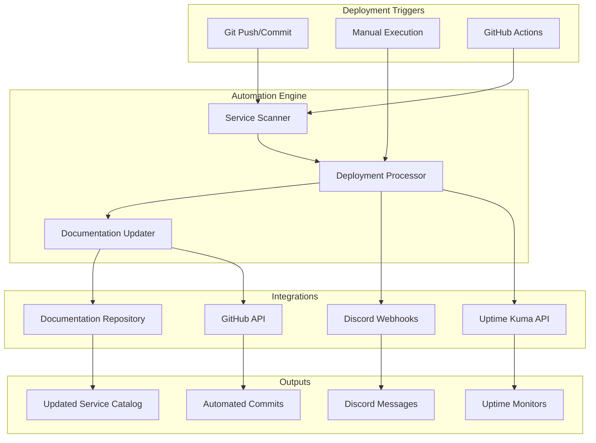

# 🤖 Deployment Automation System

This comprehensive guide covers the automated deployment management system that handles documentation updates, Discord notifications, and Uptime Kuma monitoring for your homelab infrastructure.

## 🎯 System Overview

The deployment automation system provides:

- **Automatic Documentation Updates**: Service catalog maintenance
- **Discord Notifications**: Real-time deployment alerts to #homelab-general
- **Uptime Kuma Integration**: Automated monitoring setup for external services
- **GitOps Integration**: Seamless workflow with Git-based deployments
- **Multi-Environment Support**: Staging and production environment awareness



## 🏗️ Architecture Components

### Core Automation Script

**Location**: `homelab-docs/scripts/deployment-automation.py`

The main Python script that orchestrates all automation tasks:

```python
class DeploymentAutomator:
    """
    Main automation class that handles:
    - Service detection from Kubernetes manifests
    - Documentation updates
    - Discord notifications
    - Uptime Kuma monitor creation
    """
    
    def __init__(self, config_path: str = None):
        self.base_dir = Path(__file__).parent.parent
        self.k8s_config_dir = self.base_dir.parent / "k8s-cluster-config"
        self.docs_dir = self.base_dir / "docs"
        self.service_catalog_path = self.docs_dir / "applications" / "services.md"
        
    def detect_service_changes(self) -> List[Dict]:
        """Scan k8s manifests for new/changed services"""
        
    def update_service_catalog(self, service_name: str, service_info: Dict):
        """Update the documentation with service information"""
        
    def send_discord_notification(self, message: str):
        """Send notifications to Discord #homelab-general"""
        
    def create_uptime_monitor(self, service_name: str, url: str):
        """Create Uptime Kuma monitors for external services"""
```

### Configuration Management

**Location**: `homelab-docs/scripts/automation-config.yaml`

Centralized configuration for all integrations:

```yaml
# Discord Integration
discord:
  webhook_url: "${DISCORD_HOMELAB_WEBHOOK}"
  channel: "#homelab-general"
  
# Uptime Kuma Integration
uptime_kuma:
  url: "https://uptime.staging.hallonen.se"
  username: "${UPTIME_KUMA_USERNAME}"
  password: "${UPTIME_KUMA_PASSWORD}"
  
# Documentation Settings
documentation:
  auto_commit: true
  commit_message_template: "docs: Update service catalog for {service_name}"
  
# Service Detection
detection:
  ingress_patterns:
    - "**/ingressroute.yaml"
    - "**/ingress.yaml"
  monitored_namespaces:
    - "default"
    - "monitoring"
    - "docs"
    - "demo"
    - "staging"
```

### Git Hooks Integration

**Location**: `homelab-docs/scripts/git-post-commit-hook.sh`

Automatically triggers automation on Git commits:

```bash
#!/bin/bash
# Git post-commit hook for automatic deployment detection

# Check for deployment changes
DEPLOYMENT_CHANGES=$(echo "$CHANGED_FILES" | grep -E "(ingressroute|deployment|service)\.ya?ml$")

if [ -n "$DEPLOYMENT_CHANGES" ]; then
    echo "🤖 Running deployment automation..."
    cd "$DOCS_DIR"
    python3 "$AUTOMATION_SCRIPT" --action scan
fi
```

## 🚀 Installation and Setup

### Prerequisites

- Python 3.8+ with pip
- Git repositories for both k8s-cluster-config and homelab-docs
- Discord webhook URL
- Uptime Kuma instance with API access

### Quick Setup

Run the automated setup script:

```bash
# Navigate to the docs repository
cd /path/to/homelab-docs

# Run the setup script
bash scripts/setup-automation.sh
```

The setup script will:

1. **Install Dependencies**: Python packages (pyyaml, requests)
2. **Configure Git Hooks**: Install post-commit hook in k8s-cluster-config
3. **Set Permissions**: Make scripts executable
4. **Validate Environment**: Check for required environment variables
5. **Run Test**: Execute a test scan to verify functionality

### Manual Setup

If you prefer manual installation:

```bash
# 1. Install Python dependencies
pip3 install --user pyyaml requests

# 2. Make scripts executable
chmod +x scripts/deployment-automation.py
chmod +x scripts/git-post-commit-hook.sh

# 3. Set up environment variables
export DISCORD_HOMELAB_WEBHOOK="your_discord_webhook_url"
export UPTIME_KUMA_USERNAME="your_uptime_kuma_username"
export UPTIME_KUMA_PASSWORD="your_uptime_kuma_password"

# 4. Install Git hook
cp scripts/git-post-commit-hook.sh ../k8s-cluster-config/.git/hooks/post-commit
chmod +x ../k8s-cluster-config/.git/hooks/post-commit

# 5. Test the automation
python3 scripts/deployment-automation.py --action scan
```

### Environment Variables

Add these to your shell profile (`~/.bashrc`, `~/.zshrc`):

```bash
# Homelab Automation Configuration
export DISCORD_HOMELAB_WEBHOOK="https://discord.com/api/webhooks/YOUR_WEBHOOK_ID/YOUR_WEBHOOK_TOKEN"
export UPTIME_KUMA_USERNAME="your_username"
export UPTIME_KUMA_PASSWORD="your_secure_password"
```

## 📖 Usage Guide

### Manual Operations

#### Adding a New Service

```bash
# Add a new service to the catalog
python3 scripts/deployment-automation.py \
  --action add \
  --name "Grafana" \
  --url "https://grafana.staging.hallonen.se" \
  --description "Monitoring and observability dashboard" \
  --why-selected "Industry standard for metrics visualization" \
  --maintainer "Grafana Labs"
```

#### Updating an Existing Service

```bash
# Update service information
python3 scripts/deployment-automation.py \
  --action update \
  --name "Grafana" \
  --description "Enhanced monitoring dashboard with custom panels"
```

#### Removing a Service

```bash
# Remove a service from the catalog
python3 scripts/deployment-automation.py \
  --action remove \
  --name "OldService"
```

#### Scanning for Changes

```bash
# Scan k8s-cluster-config for new services
python3 scripts/deployment-automation.py --action scan
```

### Automatic Operations

#### Git-Triggered Automation

The system automatically runs when you commit changes to k8s-cluster-config:

```bash
# In your k8s-cluster-config repository
git add apps/new-service/
git commit -m "feat: add new monitoring service"
git push

# The post-commit hook will automatically:
# 1. Detect the new service
# 2. Update documentation
# 3. Send Discord notification
# 4. Create Uptime Kuma monitor
# 5. Commit documentation changes
```

#### GitHub Actions Integration

For repositories hosted on GitHub, the enhanced workflow automatically:

1. **Detects Changes**: Scans for deployment-related file modifications
2. **Validates YAML**: Ensures Kubernetes manifests are valid
3. **Updates Documentation**: Runs automation scripts
4. **Sends Notifications**: Discord alerts with detailed change information
5. **Commits Changes**: Automatically commits documentation updates

## 🔧 Configuration Options

### Service Detection Patterns

Customize which files trigger automation:

```yaml
detection:
  ingress_patterns:
    - "**/ingressroute.yaml"      # Traefik IngressRoutes
    - "**/ingress.yaml"           # Standard Kubernetes Ingress
    - "**/gateway.yaml"           # Istio Gateways (future)
  
  deployment_patterns:
    - "**/deployment.yaml"        # Kubernetes Deployments
    - "**/statefulset.yaml"       # StatefulSets
    - "**/helmrelease.yaml"       # Flux HelmReleases
```

### Notification Customization

**Discord Message Templates**:

```python
# New service deployment
message = f"""🚀 **New Service Deployed!**

**Service**: {service_name}
**URL**: {service_info['url']}
**Description**: {service_info['description']}
**Environment**: {environment}
**Timestamp**: {timestamp}

Service catalog has been updated automatically! 📖
🔗 [View Documentation](https://docs.staging.hallonen.se)
"""

# Service update
message = f"""🔄 **Service Updated!**

**Service**: {service_name}
**Changes**: {service_info['description']}
**Environment**: {environment}
**Timestamp**: {timestamp}

Documentation has been updated! 📖
"""
```

### Uptime Kuma Monitor Configuration

Default monitor settings:

```yaml
monitor_config:
  type: "http"              # Monitor type
  interval: 60              # Check interval (seconds)
  retryInterval: 60         # Retry interval on failure
  maxRetries: 3             # Maximum retry attempts
  timeout: 30               # Request timeout
  followRedirects: true     # Follow HTTP redirects
  verifySSL: true          # Verify SSL certificates
```

## 🔍 Monitoring and Troubleshooting

### System Health Checks

Monitor automation system health:

```bash
# Check automation script status
python3 scripts/deployment-automation.py --action scan --verbose

# Verify Git hook installation
ls -la ../k8s-cluster-config/.git/hooks/post-commit

# Test Discord webhook
curl -X POST "$DISCORD_HOMELAB_WEBHOOK" \
  -H "Content-Type: application/json" \
  -d '{"content": "🧪 Test message from automation system"}'

# Check Uptime Kuma connectivity
curl -f "https://uptime.staging.hallonen.se/api/status"
```

### Common Issues and Solutions

#### 1. Environment Variables Not Set

**Problem**: Automation fails with missing webhook URL

**Solution**:
```bash
# Check current environment variables
env | grep -E "(DISCORD|UPTIME_KUMA)"

# Set missing variables
export DISCORD_HOMELAB_WEBHOOK="your_webhook_url"
# Add to shell profile for persistence
```

#### 2. Git Hook Not Triggering

**Problem**: Commits don't trigger automation

**Solution**:
```bash
# Verify hook exists and is executable
ls -la ../k8s-cluster-config/.git/hooks/post-commit
chmod +x ../k8s-cluster-config/.git/hooks/post-commit

# Test hook manually
cd ../k8s-cluster-config
.git/hooks/post-commit
```

#### 3. Documentation Not Updating

**Problem**: Service catalog not being updated

**Solution**:
```bash
# Check file permissions
ls -la docs/applications/services.md

# Verify Git repository status
git status
git log --oneline -5

# Test manual update
python3 scripts/deployment-automation.py \
  --action add \
  --name "TestService" \
  --url "https://test.example.com" \
  --description "Test service"
```

#### 4. Discord Notifications Not Sending

**Problem**: No Discord messages received

**Solution**:
```bash
# Verify webhook URL format
echo $DISCORD_HOMELAB_WEBHOOK
# Should be: https://discord.com/api/webhooks/ID/TOKEN

# Test webhook manually
curl -X POST "$DISCORD_HOMELAB_WEBHOOK" \
  -H "Content-Type: application/json" \
  -d '{"content": "Test from terminal"}'

# Check Discord server permissions
# Ensure webhook has "Send Messages" permission
```

### Logging and Debugging

Enable verbose logging:

```bash
# Run with debug information
python3 scripts/deployment-automation.py \
  --action scan \
  --verbose \
  --config scripts/automation-config.yaml

# Check system logs (if using systemd timer)
journalctl -u homelab-automation.service -f

# Monitor Git hook execution
tail -f /tmp/homelab-automation.log
```

## 🔒 Security Considerations

### Webhook Security

- **Use HTTPS**: Always use secure webhook URLs
- **Token Rotation**: Regularly rotate Discord webhook tokens
- **Scope Limitation**: Use dedicated channels with limited permissions

### API Access

- **Credential Management**: Store sensitive credentials securely
- **Access Control**: Use least-privilege principles for API access
- **Audit Logging**: Monitor API usage and access patterns

### Code Security

- **Input Validation**: Sanitize all user inputs and service data
- **Path Traversal**: Prevent directory traversal attacks
- **Command Injection**: Validate all shell commands and arguments

## 📊 Metrics and Analytics

### Automation Metrics

Track automation system performance:

```yaml
# Prometheus metrics (planned)
homelab_automation_runs_total{status="success"}
homelab_automation_runs_total{status="failure"}
homelab_automation_duration_seconds
homelab_automation_services_detected_total
homelab_automation_notifications_sent_total
```

### Usage Analytics

Monitor system usage patterns:

- **Service Discovery Rate**: How often new services are detected
- **Documentation Updates**: Frequency of catalog updates
- **Notification Delivery**: Success rate of Discord messages
- **Monitor Creation**: Number of Uptime Kuma monitors created

## 🚀 Advanced Features

### Custom Service Extractors

Extend service detection for different manifest types:

```python
def extract_helm_release_info(self, manifest: Dict) -> Optional[Dict]:
    """Extract service info from Flux HelmRelease"""
    if manifest.get('kind') != 'HelmRelease':
        return None
        
    # Custom extraction logic for HelmReleases
    chart = manifest.get('spec', {}).get('chart', {})
    values = manifest.get('spec', {}).get('values', {})
    
    return {
        "name": manifest['metadata']['name'],
        "chart": chart.get('chart'),
        "version": chart.get('version'),
        "namespace": manifest['metadata']['namespace']
    }
```

### Multi-Environment Support

Configure different behavior per environment:

```yaml
environments:
  staging:
    discord_channel: "#staging-deployments"
    uptime_kuma_group: "staging-monitors"
    auto_commit: true
    
  production:
    discord_channel: "#production-alerts"
    uptime_kuma_group: "production-monitors"
    auto_commit: false  # Require manual review
    require_approval: true
```

### Integration Extensions

#### Slack Integration

```python
def send_slack_notification(self, message: str, webhook_url: str):
    """Send notification to Slack"""
    payload = {
        "text": message,
        "username": "Homelab Bot",
        "channel": "#homelab-general",
        "icon_emoji": ":robot_face:"
    }
    requests.post(webhook_url, json=payload)
```

#### PagerDuty Integration

```python
def create_pagerduty_service(self, service_name: str, service_url: str):
    """Create PagerDuty service for critical services"""
    if service_name in self.config['critical_services']:
        # Create PagerDuty service and escalation policy
        pass
```

## 🎯 Best Practices

### 1. Documentation Standards

- **Consistent Formatting**: Use standardized service descriptions
- **Complete Information**: Include all required fields (URL, description, maintainer)
- **Regular Updates**: Keep service information current

### 2. Notification Management

- **Avoid Spam**: Implement rate limiting and deduplication
- **Meaningful Messages**: Provide actionable information
- **Channel Organization**: Use appropriate channels for different environments

### 3. Monitoring Strategy

- **Critical Services Only**: Don't monitor every service automatically
- **Appropriate Intervals**: Balance monitoring frequency with resource usage
- **Health Check Design**: Ensure monitors test actual service functionality

### 4. Automation Reliability

- **Error Handling**: Graceful failure and recovery
- **Idempotent Operations**: Safe to run multiple times
- **Rollback Capability**: Ability to undo changes if needed

## 📚 Additional Resources

### Documentation Links

- [Service Catalog](../applications/services.md) - Current service documentation
- [GitOps Workflow](../kubernetes/gitops.md) - Understanding the deployment process
- [Monitoring Setup](../kubernetes/monitoring.md) - Monitoring infrastructure details

### External Resources

- [Discord Webhooks Documentation](https://discord.com/developers/docs/resources/webhook)
- [Uptime Kuma API Documentation](https://github.com/louislam/uptime-kuma/wiki/API)
- [FluxCD Documentation](https://fluxcd.io/docs/)
- [Kubernetes API Reference](https://kubernetes.io/docs/reference/)

### Community

- **Homelab Communities**: r/homelab, homelab Discord servers
- **Kubernetes Communities**: Kubernetes Slack, CNCF community
- **GitOps Communities**: FluxCD community, GitOps working group

---

This automation system transforms manual deployment tracking into a seamless, automated workflow that keeps your documentation current and your team informed. The system is designed to be reliable, extensible, and secure while providing immediate value for homelab operations.
